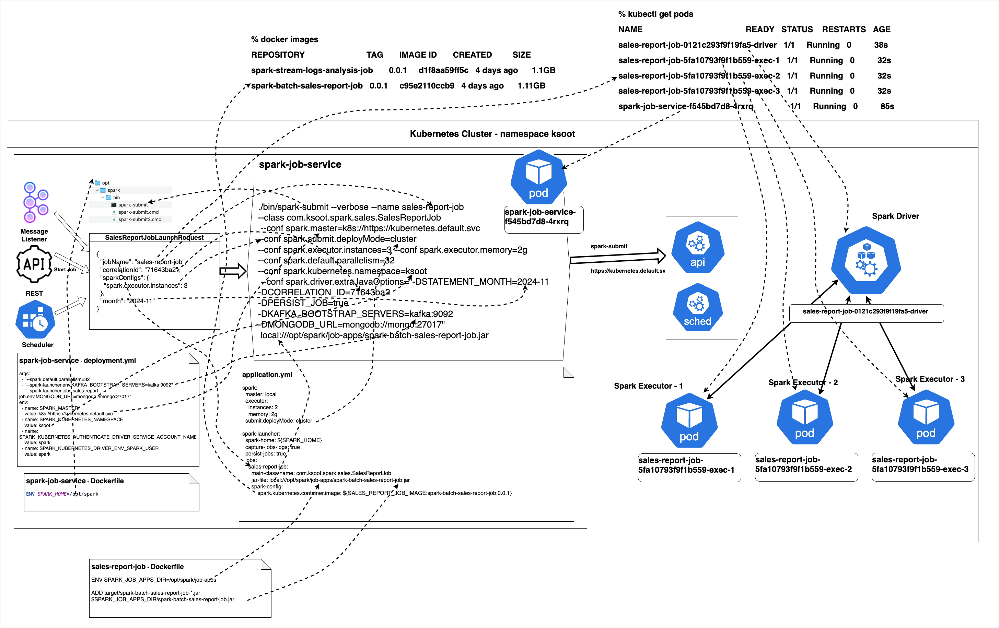

# A Unified Framework for Building and Running Spark Jobs with Spring Boot and Deployment on Local and Minikube or Kubernetes
An innovative approach to implementing Spark Jobs with Spring Boot ecosystem, enabling developer-friendly environment.  
It integrates cross-cutting concerns as reusable libraries to minimize boilerplate code.  
Moreover, the framework supports one-click deployment of Spark jobs with RESTful APIs, making it a breeze to run jobs locally, on Minikube or Kubernetes.

### Apache Spark overview
[Apache Spark](https://spark.apache.org/docs/3.5.3/index.html) is a distributed computing framework designed for fast and efficient large-scale data processing.  
Its architecture enables in-memory computing, making it significantly faster than traditional disk-based systems like Hadoop MapReduce.  
Here’s a brief breakdown of Spark’s architecture:

1. **Core Components**
- Driver: The driver is the central control unit that coordinates the execution of tasks. It:
  - Converts user-defined code into tasks.
  - Distributes these tasks across executors.
  - Tracks the progress and status of the tasks.
- Executors: These are worker processes running on cluster nodes. They:
  - Execute the tasks assigned by the driver.
  - Store data partitions in memory or disk, enabling iterative computations.
- Cluster Manager: Spark relies on a cluster manager (e.g., YARN, Mesos, Kubernetes etc.) to manage resources and schedule jobs across the cluster.

2. **Resilient Distributed Dataset (RDD)**  
At the core of Spark’s architecture is the RDD, a fault-tolerant and immutable distributed collection of objects.  
RDDs allow parallel operations and automatic recovery from node failures.  
The Latest Spark versions have introduced and recommend DataFrames and Datasets, which are back by RDD.

3. **Key Abstractions**
- **Transformations**: Operations like map() or filter() create a new RDD from an existing one. Transformations are lazy and executed only when an action is called.
- **Actions**: Operations like reduce() or collect() trigger the computation of RDDs and return a result.

4. **Execution Workflow**
- Spark splits the execution of a job into stages.
- Within each stage, tasks are executed in parallel across the cluster.
- The Directed Acyclic Graph (DAG) Scheduler optimizes task execution by constructing a dependency graph of RDD transformations.


## Introduction
Spring Boot has become de-facto standard for Java application developement. It offers a robust framework for building scalable, enterprise-grade data processing applications.
For beginners, it's tedious to build Spark Jobs on top using Spring boot and deployment on local and Kubernetes.
This framework aims to simplify the process by providing a unified solution for building, running and deploying Spark jobs with Spring Boot.

# Installation
## Prerequisites
- Java 17
- [Scala 2.12.18](https://sdkman.io/install/)
- [Spark 3.5.3](https://archive.apache.org/dist/spark/spark-3.5.3/spark-3.5.3-bin-hadoop3.tgz)
- [Minikube](https://minikube.sigs.k8s.io/docs/)
- IDE (IntelliJ, Eclipse or VS Code)
- Optional [Configure Formatter in intelliJ](https://github.com/google/google-java-format/blob/master/README.md#intellij-android-studio-and-other-jetbrains-ides), refer to [fmt-maven-plugin](https://github.com/spotify/fmt-maven-plugin) for details.

### Java
Recommended [sdkman](https://sdkman.io/install/) for managing Java, Scala installations.
Make sure `JAVA_HOME` set to Java 17 installation path and `PATH` variable contains entry for `$JAVA_HOME/bin`
Check Java version as follows. It should look like following, showing major version 17.
```shell
% java -version
openjdk version "17.0.12" 2024-07-16
OpenJDK Runtime Environment Temurin-17.0.12+7 (build 17.0.12+7)
OpenJDK 64-Bit Server VM Temurin-17.0.12+7 (build 17.0.12+7, mixed mode)
```

### Scala
Check Scala version as follows. It should look like following, showing scala version 2.12.18.
```shell
% scala -version
Scala code runner version 2.12.18 -- Copyright 2002-2023, LAMP/EPFL and Lightbend, Inc.
```

### Spark
Download and extract [spark-3.5.3-bin-hadoop3](https://archive.apache.org/dist/spark/spark-3.5.3/spark-3.5.3-bin-hadoop3.tgz) on your machine and Set the following environment variables.
```shell
export SPARK_HOME="/<your directory>/spark-3.5.3-bin-hadoop3"
export SPARK_CONF_DIR=$SPARK_HOME/conf
export PATH="$SPARK_HOME/bin:$PATH"
```

## Environment setup
The demo jobs and `spark-job-service` need following services up and running.
- Make sure **Postgres** is running at `localhost:5432` with username `postgres` and password `admin`.  
  Create databases `spark_jobs_db` and `error_logs_db` if they do not exist.
- Make sure **MongoDB** running at `localhost:27017`.
- Make sure **ArangoDB** running at `localhost:8529` with `root` password as `admin`.
- Make sure **Kafka** running with bootstrap servers `localhost:9092`.
- Make sure **Kafka UI** running at `http://localhost:8100`. Create topics `job-stop-requests` and `error-logs` if they do not exist.

> [!IMPORTANT]  
> It is recommended to have port numbers same as mentioned above, otherwise you may need to change at multiple places i.e. in job's `application-local.yml`, `spark-job-service` application ymls and deployment yml etc.

### There are three ways to have required infrastructure up and running.
#### Manual
All these services can be installed locally on your machine, and should be accessible at above-mentioned urls and credentials (wherever applicable).

#### Docker compose
* The [docker-compose.yml](docker-compose.yml) file defines the services and configurations to run required infrastructure in Docker. 
* Make sure Docker is running. 
* In Terminal go to project root `spring-boot-spark-kubernetes` and execute following command and Check if all services are running.
```shell
docker compose up -d
```
* Create databases `spark_jobs_db` and `error_logs_db` and Kafka topics `job-stop-requests` and `error-logs` if they do not exist.

> [!IMPORTANT]  
> While using docker compose make sure the required ports are free on your machine otherwise it will throw port busy error.

#### Minikube
The [infra-k8s-deployment.yml](infra-k8s-deployment.yml) file defines the services and configurations to run required infrastructure in Minikube.
* Set minikube cores to 4 and memory to 8GB atleast.
* Make sure docker is running and minikube is started.
* In Terminal go to project root `spring-boot-spark-kubernetes` and execute following command.
```shell
kubectl apply -f infra-k8s-deployment.yml
```
* Set default namespace to `ksoot` in minikube. You can always rollback it to default namespace.
```shell
kubectl config set-context --current --namespace=ksoot
```
* Check if all infra pods are running.
```shell
kubectl get pods
```
Output should look like below.
```shell
NAME                         READY   STATUS    RESTARTS   AGE
arango-65d6fff6c5-4bjwq      1/1     Running   0          6m16s
kafka-74c8d9579f-jmcr5       1/1     Running   0          6m16s
kafka-ui-797446869-9d8zw     1/1     Running   0          6m16s
mongo-6785c5cf8b-mtbk7       1/1     Running   0          6m16s
postgres-685b766f66-7dnsl    1/1     Running   0          6m16s
zookeeper-6fc87d48df-2t5pf   1/1     Running   0          6m16s
```
* Establish minikube tunnel to expose services of type `LoadBalancer` running in Minikube cluster to local machine.  
It creates a bridge between your local network and the Minikube cluster, making the required infrastructure accessible to local.
```shell
minikube tunnel
```
Keep it running in a separate terminal. Output should look like below.
```shell
✅  Tunnel successfully started

📌  NOTE: Please do not close this terminal as this process must stay alive for the tunnel to be accessible ...

🏃  Starting tunnel for service arango.
🏃  Starting tunnel for service kafka.
🏃  Starting tunnel for service kafka-ui.
🏃  Starting tunnel for service mongo.
🏃  Starting tunnel for service postgres.
🏃  Starting tunnel for service zookeeper.
```
* No need to create any databases or kafka topics required by applications as they are automatically created by [infra-k8s-deployment.yml](infra-k8s-deployment.yml).

# Framework Architecture
The proposed framework provides a comprehensive solution for building, running and deploying Spark jobs seamlessly.

### Features
Offers following features.
- **Job Launching**: Trigger Spark jobs via REST endpoint for deployment on local and kubernetes.
- **Job Termination**: Accept requests to stop running jobs via REST endpoint, though not a gauranteed method. You may need to kill the job manually if not terminated by this.
- **Job Monitoring**: Track job status, start and end time, duration taken, error messages if there is any, via REST endpoints.
- **Auto-configurations**: of Common components such as `SparkSession`, Job lifecycle listener and Connectors to read and write to various datasources.
- **Demo Jobs**: A [Spark Batch Job](spark-batch-daily-sales-report-job) and another [Spark Streaming Job](spark-stream-logs-analysis-job), to start with

### Components
The framework consists of following components. Refer to respective project's README for details.
- [**spark-job-service**](spark-job-service/README.md): A Spring Boot application to launch Spark jobs and monitor their status.
- [**spring-boot-starter-spark**](https://github.com/officiallysingh/spring-boot-starter-spark): Spring boot starter for Spark for Csutomizable `SparkSession` auto-configurations.
- [**spark-job-commons**](spark-job-commons/README.md): A library to provide common Job components and utilities for Spark jobs.
- [**spark-batch-daily-sales-report-job**](spark-batch-daily-sales-report-job/README.md): A demo Spark Batch Job to generate daily sales report.
- [**spark-stream-logs-analysis-job**](spark-stream-logs-analysis-job/README.md): A demo Spark Streaming Job to analyze logs in real-time.

### Running Jobs Locally
- Spark Jobs can be run as Spring boot application locally in your favorite IDE. Refer to [daily-sales-job README](spark-batch-daily-sales-report-job/README.md#intellij-run-configurations) and [log-analysis-job README](spark-stream-logs-analysis-job/README.md#intellij-run-configurations).
- Spark Job can be Launched via REST API provided by `spark-job-service`. Refer to [spark-job-service README](spark-job-service/README.md#running-locally) for details.
- You can Run `spark-job-service` and Launch Jobs on Minikube or Kubernetes. Refer to [spark-job-service README](spark-job-service/README.md#running-application-locally) for details.

### Running Jobs on Kubernetes
#### Deploy Modes
There are two deployment modes for Spark Job deployment on Kubernetes.
- **Client Deploy Mode**: The driver runs in the client’s JVM process and communicates with the executors managed by the cluster.
- **Cluster Deploy Mode**: The driver process runs as a separate JVM process in a cluster, and the cluster manages its resources.


#### Deployment Process
- **Build Spark base Docker Image**: Build custom base Docker image for Spark for more control over it, refer to [Dockerfile](Dockerfile) for details.  
Spark contains a lot of jars, some of which may conflict with your application jars. So you may need to exclude such jars from Spark.  
For example following conflicting jars are excluded from Spark.
```shell
# Remove any spark jars that may be conflict with the ones in your application dependencies.
rm -f jars/protobuf-java-2.5.0.jar; \
rm -f jars/guava-14.0.1.jar; \
rm -f jars/HikariCP-2.5.1.jar; \
```
- **Build Spark Jobs Docker Images**: Build Docker image for Spark Job, refer to [daily-sales-job README](spark-batch-daily-sales-report-job/README.md#build) and [logs-analysis-job README](spark-stream-logs-analysis-job/README.md#build) for details.
- **Build `spark-job-service` Docker Image**: Refer to [spark-job-service README](spark-job-service/README.md#running-on-minikube).
- **Deploy Infrastructure**: As described in [Spark Kubernetes deployment documentation](https://spark.apache.org/docs/3.4.1/running-on-kubernetes.html#rbac). The Following is required to allow Spark to be able to manage Driver and Executor pods.  
Demo [infra-k8s-deployment.yml](infra-k8s-deployment.yml) is provided to deploy required infrastructure in namespace `ksoot`. You can change the namespace as per your requirement.
```yaml
---
apiVersion: rbac.authorization.k8s.io/v1
kind: ClusterRoleBinding
metadata:
name: fabric8-rbac
subjects:
- kind: ServiceAccount
  name: default
  namespace: ksoot
  roleRef:
  kind: ClusterRole
  name: cluster-admin
  apiGroup: rbac.authorization.k8s.io
---
apiVersion: v1
kind: ServiceAccount
metadata:
name: spark
namespace: ksoot
---
apiVersion: rbac.authorization.k8s.io/v1
kind: ClusterRoleBinding
metadata:
name: spark-role
subjects:
- kind: ServiceAccount
  name: spark
  namespace: ksoot
  roleRef:
  kind: ClusterRole
  name: edit
  apiGroup: rbac.authorization.k8s.io
```
* **Update `spark.master`** with your Kubernetes master URL in [spark-job-service deployment.yml](spark-job-service/deployment.yml).
* **Deploy `spark-job-service`** using its [deployment.yml](spark-job-service/deployment.yml). Refer to [spark-job-service README](spark-job-service/README.md#running-on-minikube) for details.
* **Deploy Spark Jobs** using [REST APIs](spark-job-service/README.md#api-reference) provided by `spark-job-service`.
* You can override any configurations that are defined in [spark-job-service application.yml](spark-job-service/src/main/resources/config/application.yml) of spark-job-service and Spark Jobs using environment variables in [spark-job-service deployment.yml](spark-job-service/deployment.yml) as follows.
```yaml
env:
  - name: SPARK_MASTER
    value: k8s://https://kubernetes.default.svc
  - name: SPARK_KUBERNETES_NAMESPACE
    value: ksoot
  - name: SPARK_KUBERNETES_AUTHENTICATE_DRIVER_SERVICE_ACCOUNT_NAME
    value: spark
  - name: SPARK_KUBERNETES_DRIVER_ENV_SPARK_USER
    value: spark
  - name: SPARK_SUBMIT_DEPLOY_MODE
    value: cluster
  # Application properties
  - name: KAFKA_BOOTSTRAP_SERVERS
    value: kafka:9092
  - name: POSTGRES_URL
    value: jdbc:postgresql://postgres:5432/spark_jobs_db
  - name: JDBC_URL
    value: jdbc:postgresql://postgres:5432
  - name: PERSIST_JOBS
    value: "true"
  - name: CAPTURE_JOBS_LOGS
    value: "true"
```
* You can override any configurations that are not defined in [spark-job-service application.yml](spark-job-service/src/main/resources/config/application.yml) as follows.
```yaml
args:
  - "--spark.executor.instances=2"
  - "--spark.default.parallelism=16"
  - "--spark-launcher.env.POSTGRES_URL=jdbc:postgresql://postgres:5432/spark_jobs_db"
  - "--spark-launcher.env.KAFKA_BOOTSTRAP_SERVERS=kafka:9092"
  - "--spark-launcher.jobs.daily-sales-report-job.env.MONGODB_URL=mongodb://mongo:27017"
  - "--spark-launcher.jobs.daily-sales-report-job.env.ARANGODB_URL=arango:8529"
  - "--spark-launcher.jobs.logs-analysis-job.env.JDBC_URL=jdbc:postgresql://postgres:5432"
```
#### How Spark Job Deployment works
- Each Docker image has Spark installed in the container.
- At its core, it executes `spark-submit` command built dynamically using configurations provided at multiple levels when the request to Launch a Spark Job is received, as explained in [Job Launcher Implementation](spark-job-service/README.md#launcher-implementation).



## Licence
Open source [**The MIT License**](http://www.opensource.org/licenses/mit-license.php)

## Authors and acknowledgment
[**Rajveer Singh**](https://www.linkedin.com/in/rajveer-singh-589b3950/), In case you find any issues or need any support, please email me at raj14.1984@gmail.com.
Give me a :star: and a :clap: on [**medium.com**](https://officiallysingh.medium.com/spark-spring-boot-starter-e206def765b9) if you find it helpful.

## References
- [Apache Spark](https://spark.apache.org/docs/3.5.3)
- [Spark in Action](https://www.manning.com/books/spark-in-action-second-edition)
- [Spark Configurations](https://spark.apache.org/docs/3.5.3/configuration.html)
- [Spark Submit](https://spark.apache.org/docs/3.5.4/submitting-applications.html)
- [Running Spark on Kubernetes](https://spark.apache.org/docs/3.5.4/running-on-kubernetes.html)
- [Spark Streaming](https://spark.apache.org/docs/3.5.3/streaming-programming-guide.html)
- [Spark ArangoDB Connector](https://docs.arangodb.com/3.13/develop/integrations/arangodb-datasource-for-apache-spark)
- [Spark MongoDB Connector](https://www.mongodb.com/docs/spark-connector/v10.4)
- [Spark Kafka Connector](https://spark.apache.org/docs/3.5.1/structured-streaming-kafka-integration.html)
- [Spring Cloud Task](https://spring.io/projects/spring-cloud-task)
- [Exception handling in Spring boot Web applications](https://github.com/officiallysingh/spring-boot-problem-handler).
- [Spring boot starter for Spark](https://github.com/officiallysingh/spring-boot-starter-spark).