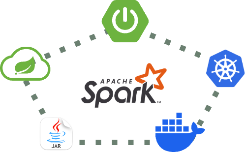

# Unified Framework for Building Spark Jobs with Spring boot and Running on Local and Kubernetes
An innovative approach to implementing Spark Jobs with Spring Boot ecosystem, enabling developer-friendly environment. 
It integrates cross-cutting concerns as reusable libraries to minimize boilerplate code. 
Moreover, the framework supports one-click deployment of Spark jobs with RESTful APIs, making it a breeze to run jobs locally, on Minikube or Kubernetes.  



## Apache Spark overview
[Apache Spark](https://spark.apache.org/docs/3.5.3/index.html) is a distributed computing framework designed for fast and efficient large-scale data processing.  
Its architecture enables in-memory computing, making it significantly faster than traditional disk-based systems like Hadoop MapReduce.  
Here’s a brief breakdown of Spark’s architecture:

1. **Core Components**
- Driver: The driver is the central control unit that coordinates the execution of tasks. It:
  - Converts user-defined code into tasks.
  - Distributes these tasks across executors.
  - Tracks the progress and status of the tasks.
- Executors: These are worker processes running on cluster nodes. They:
  - Execute the tasks assigned by the driver.
  - Store data partitions in memory or disk, enabling iterative computations.
- Cluster Manager: Spark relies on a cluster manager (e.g., YARN, Mesos and Kubernetes etc.) to manage resources and schedule jobs across the cluster.

2. **Resilient Distributed Dataset (RDD)**  
At the core of Spark’s architecture is the RDD, a fault-tolerant and immutable distributed collection of objects.  
RDDs allow parallel operations and automatic recovery from node failures.  
The Latest Spark versions have introduced and recommend DataFrames and Datasets, which are back by RDD.

3. **Key Abstractions**
- **Transformations**: Operations like map() or filter() create a new RDD from an existing one. Transformations are lazy and executed only when an action is called.
- **Actions**: Operations like reduce() or collect() trigger the computation of RDDs and return a result.

4. **Execution Workflow**
- Spark splits the execution of a job into stages.
- Within each stage, tasks are executed in parallel across the cluster.
- The Directed Acyclic Graph (DAG) Scheduler optimizes task execution by constructing a dependency graph of RDD transformations.

**Apache Spark Distributed Architecture**


## Introduction
Spring Boot has become de-facto standard for Java application developement. It offers a robust framework for building scalable, enterprise-grade applications.
It could be tedious to build Spark Jobs using Spring boot and deployment on local and Kubernetes.
This framework aims to simplify this process by providing a unified solution for building Spark jobs with Spring Boot, running locally and deployment on Minikube or Kubernetes.

## Installation
### Prerequisites
- Java 17
- [Maven](https://maven.apache.org), Make sure environment variable `M2_REPO` is set to local maven repository
- [Scala 2.12.18](https://www.scala-lang.org/download/2.12.18.html)
- [Spark 3.5.3](https://spark.apache.org/docs/3.5.3), Make sure environment variable `SPARK_HOME` is set to local spark installation.
- [Docker](https://www.docker.com), Make sure Docker is allocated with enough resources.
- [Minikube](https://minikube.sigs.k8s.io/docs/), Make sure Docker is allocated with enough resources.
- IDE (IntelliJ, Eclipse or VS Code), Recommended [IntelliJ IDEA](https://www.jetbrains.com/idea).
- Optional [Configure Formatter in intelliJ](https://github.com/google/google-java-format/blob/master/README.md#intellij-android-studio-and-other-jetbrains-ides), refer to [fmt-maven-plugin](https://github.com/spotify/fmt-maven-plugin) for details.

#### Java
Recommended [sdkman](https://sdkman.io/install/) for managing Java, Scala installations.
Make sure `JAVA_HOME` set to Java 17 installation path and `PATH` variable contains entry for `$JAVA_HOME/bin`
Check Java version as follows. It should look like following, showing major version 17.
```shell
% java -version
openjdk version "17.0.12" 2024-07-16
OpenJDK Runtime Environment Temurin-17.0.12+7 (build 17.0.12+7)
OpenJDK 64-Bit Server VM Temurin-17.0.12+7 (build 17.0.12+7, mixed mode)
```

#### Scala
Check Scala version as follows. It should look like following, showing scala version 2.12.18.
```shell
% scala -version
Scala code runner version 2.12.18 -- Copyright 2002-2023, LAMP/EPFL and Lightbend, Inc.
```

#### Spark
Download and extract [spark-3.5.3-bin-hadoop3](https://archive.apache.org/dist/spark/spark-3.5.3/spark-3.5.3-bin-hadoop3.tgz) on your machine and Set the following environment variables.
```shell
export SPARK_HOME="/<your directory>/spark-3.5.3-bin-hadoop3"
export SPARK_CONF_DIR=$SPARK_HOME/conf
export PATH="$SPARK_HOME/bin:$PATH"
```

### Environment setup
The demo jobs and `spark-job-service` need following services up and running.
- Make sure **Postgres** is running at `localhost:5432` with username `postgres` and password `admin`.  
  Create databases `spark_jobs_db` and `error_logs_db` if they do not exist.
- Make sure **MongoDB** running at `localhost:27017`.
- Make sure **ArangoDB** running at `localhost:8529` with `root` password as `admin`.
- Make sure **Kafka** running with bootstrap servers `localhost:9092`.
- Make sure **Kafka UI** running at `http://localhost:8100`. Create topics `job-stop-requests` and `error-logs` if they do not exist.

> [!IMPORTANT]  
> It is recommended to have port numbers same as mentioned above, otherwise you may need to change at multiple places i.e. in job's `application-local.yml`, `spark-job-service` application ymls and deployment yml etc.

#### Manual
All these services can be installed locally on your machine, and should be accessible at above-mentioned urls and credentials (wherever applicable).

#### Docker compose
* The [docker-compose.yml](docker-compose.yml) file defines the services and configurations to run required infrastructure in Docker. 
* In Terminal go to project root `spring-boot-spark-kubernetes` and execute following command and confirm if all services are running.
```shell
docker compose up -d
```
* Create databases `spark_jobs_db` and `error_logs_db` in Postgres and Kafka topics `job-stop-requests` and `error-logs` if they do not exist.

> [!IMPORTANT]  
> While using docker compose make sure the required ports are free on your machine, otherwise port busy error could be thrown.

#### Minikube
* In Terminal go to project root `spring-boot-spark-kubernetes` and execute following commands to create a namespace `ksoot` and necessary Kubernetes services in given namespace. 
Refer to [Kubernetes configuration files section](#kubernetes-configuration-files) for more details.
```shell
kubectl apply -f infra-k8s-deployment.yml
kubectl apply -f spark-rbac.yml
```
* Set default namespace to `ksoot` in minikube. You can always rollback to default namespace.
```shell
kubectl config set-context --current --namespace=ksoot
```
* Check if all infra pods are running.
```shell
kubectl get pods
```
Output should look like below.
```shell
NAME                         READY   STATUS    RESTARTS   AGE
arango-65d6fff6c5-4bjwq      1/1     Running   0          6m16s
kafka-74c8d9579f-jmcr5       1/1     Running   0          6m16s
kafka-ui-797446869-9d8zw     1/1     Running   0          6m16s
mongo-6785c5cf8b-mtbk7       1/1     Running   0          6m16s
postgres-685b766f66-7dnsl    1/1     Running   0          6m16s
zookeeper-6fc87d48df-2t5pf   1/1     Running   0          6m16s
```
* Establish minikube tunnel to expose services of type `LoadBalancer` running in Minikube cluster to local machine. 
It creates a bridge between your local network and the Minikube cluster, making the required infrastructure accessible to local.
```shell
minikube tunnel
```
Keep it running in a separate terminal. Output should look like below.
```shell
✅  Tunnel successfully started

📌  NOTE: Please do not close this terminal as this process must stay alive for the tunnel to be accessible ...

🏃  Starting tunnel for service arango.
🏃  Starting tunnel for service kafka.
🏃  Starting tunnel for service kafka-ui.
🏃  Starting tunnel for service mongo.
🏃  Starting tunnel for service postgres.
🏃  Starting tunnel for service zookeeper.
```
* No need to create any databases or kafka topics required by applications as they are automatically created by [infra-k8s-deployment.yml](infra-k8s-deployment.yml).

## Framework Architecture

### Features
- **Job Launching**: Trigger Spark jobs via REST endpoint for deployment on local and kubernetes.
- **Job Termination**: Accept requests to stop running jobs via REST endpoint, though not a gauranteed method. You may need to kill the job manually if not terminated by this.
- **Job Monitoring**: Track job status, start and end time, duration taken, error messages if there is any, via REST endpoints.
- **Auto-configurations**: of Common components such as `SparkSession`, Job lifecycle listener and Connectors to read and write to various datasources.
- **Demo Jobs**: A [Spark Batch Job](spark-batch-sales-report-job) and another [Spark Streaming Job](spark-stream-logs-analysis-job), to start with.

### Components
The framework consists of following components. Refer to respective project's README for details.
- [**spark-job-service**](spark-job-service/README.md): A Spring Boot application to launch Spark jobs and monitor their status.
- [**spring-boot-starter-spark**](https://github.com/officiallysingh/spring-boot-starter-spark): Spring boot starter for Spark.
- [**spark-job-commons**](spark-job-commons/README.md): A library to provide common Job components and utilities for Spark jobs.
- [**spark-batch-sales-report-job**](spark-batch-sales-report-job/README.md): A demo Spark Batch Job to generate Monthly sales reports.
- [**spark-stream-logs-analysis-job**](spark-stream-logs-analysis-job/README.md): A demo Spark Streaming Job to analyze logs in real-time.

### Kubernetes configuration files
The framework includes Kubernetes configuration files to deploy the required infrastructure and services in a Kubernetes cluster in namespace **`ksoot`**. You can change the namespace in these two files as per your requirement.
Each service is configured with necessary environment variables, volume mounts, and ports to ensure proper operation within the Kubernetes cluster.
1. The [infra-k8s-deployment.yml](infra-k8s-deployment.yml) file defines the Kubernetes resources required to deploy various services.
- **Namespace**: Creates a namespace **`ksoot`**.
- **MongoDB**: Deployment, PersistentVolumeClaim, and Service for MongoDB.
- **ArangoDB**: Deployment, PersistentVolumeClaim, and Service for ArangoDB.
- **PostgreSQL**: Deployment, PersistentVolumeClaim, ConfigMap (for initialization script), and Service for PostgreSQL.
- **Zookeeper**: Deployment, PersistentVolumeClaims (for data and logs), and Service for Zookeeper.
- **Kafka**: Deployment, PersistentVolumeClaim, and Service for Kafka.
- **Kafka UI**: Deployment and Service for Kafka UI.
2. The [spark-rbac.yml](spark-rbac.yml) file defines the Kubernetes `RBAC` (Role-Based Access Control) resources required to allow Spark to manage Driver and Executor pods within the **`ksoot`** namespace.
- **ClusterRoleBinding**: Binds the default `ServiceAccount` to the `cluster-admin` `ClusterRole`, allowing it to have cluster-wide administrative privileges.
- **ServiceAccount**: Creates a ServiceAccount named `spark`.
- **ClusterRoleBinding**: Binds the spark ServiceAccount to the `edit` `ClusterRole`, granting it permissions to edit resources within the namespace.

### Running Jobs Locally
- Individual Spark Jobs can be run as Spring boot application locally in your favorite IDE. Refer to [sales-report-job](spark-batch-sales-report-job/README.md#intellij-run-configurations) and [logs-analysis-job](spark-stream-logs-analysis-job/README.md#intellij-run-configurations).
- Spark Job can be Launched locally via REST API provided by `spark-job-service`. Refer to [spark-job-service](spark-job-service/README.md#running-locally) for details.

### Running Jobs on Minikube
#### Preparing for Minikube
* Make sure minikube infra is ready as mentioned in [Minikube Environment setup section](#minikube).
* Build custom base Docker image for Spark for more control over it, Refer to base [Dockerfile](Dockerfile) for details. Spark contains a lot of jars at `${SPARK_HOME/jars}`, some of which may conflict with your application jars. So you may need to exclude such jars from Spark.  
  For example following conflicting jars are excluded from Spark in base [Dockerfile](Dockerfile).
```shell
# Remove any spark jars that may be conflict with the ones in your application dependencies.
rm -f jars/protobuf-java-2.5.0.jar; \
rm -f jars/guava-14.0.1.jar; \
rm -f jars/HikariCP-2.5.1.jar; \
```
* In Terminal go to root project `spring-boot-spark-kubernetes` and execute the following command to build Spark base Docker image. All Job's Dockerfiles extend from this image.
```shell
docker image build . -t ksoot/spark:3.5.3 -f Dockerfile
```
* In Terminal go to project `spring-boot-spark-kubernetes/spark-batch-sales-report-job` and execute following command to build docker image for `sales-report-job`.
```shell
docker image build . -t spark-batch-sales-report-job:0.0.1 -f Dockerfile
```
* In Terminal go to project `spring-boot-spark-kubernetes/spark-stream-logs-analysis-job` and execute following command to build docker image for `logs-analysis-job`.
```shell
docker image build . -t spark-stream-logs-analysis-job:0.0.1 -f Dockerfile
```
* Load Job images in minikube.
```shell
minikube image load spark-batch-sales-report-job:0.0.1
minikube image load spark-stream-logs-analysis-job:0.0.1
```
* In Terminal go to project `spring-boot-spark-kubernetes/spark-job-service` and execute following command to build docker image for `spark-job-service`.
```shell
docker image build . -t spark-job-service:0.0.1 -f Dockerfile
```
* Load Job `spark-job-service` image in minikube.
```shell
minikube image load spark-job-service:0.0.1
```

#### Running on Minikube
* Make sure [Environment setup on Minikube](#minikube) is already done and [application artifacts are ready](#preparing-for-minikube).
> [!IMPORTANT]  
> No configuration change is required except specifically asked to run this code locally.
* You can override any configurations **that are defined in** [spark-job-service application.yml](spark-job-service/src/main/resources/config/application.yml) and Spark Jobs using environment variables in [spark-job-service deployment.yml](spark-job-service/deployment.yml) as follows.
```yaml
env:
  # Spark properties
  - name: SPARK_MASTER
    value: k8s://https://kubernetes.default.svc
  - name: SPARK_KUBERNETES_NAMESPACE
    value: ksoot
  - name: SPARK_KUBERNETES_AUTHENTICATE_DRIVER_SERVICE_ACCOUNT_NAME
    value: spark
  - name: SPARK_KUBERNETES_DRIVER_ENV_SPARK_USER
    value: spark
  - name: SPARK_SUBMIT_DEPLOY_MODE
    value: cluster
  # Application properties
  - name: KAFKA_BOOTSTRAP_SERVERS
    value: kafka:9092
  - name: POSTGRES_URL
    value: jdbc:postgresql://postgres:5432/spark_jobs_db
  - name: JDBC_URL
    value: jdbc:postgresql://postgres:5432
  - name: PERSIST_JOBS
    value: "true"
  - name: CAPTURE_JOBS_LOGS
    value: "true"
```
* You can override any configurations **that are not defined in** [spark-job-service application.yml](spark-job-service/src/main/resources/config/application.yml) as follows.
```yaml
args:
  - "--spark.executor.instances=2"
  - "--spark.default.parallelism=16"
  - "--spark-launcher.env.POSTGRES_URL=jdbc:postgresql://postgres:5432/spark_jobs_db"
  - "--spark-launcher.env.KAFKA_BOOTSTRAP_SERVERS=kafka:9092"
  - "--spark-launcher.jobs.sales-report-job.env.MONGODB_URL=mongodb://mongo:27017"
  - "--spark-launcher.jobs.sales-report-job.env.ARANGODB_URL=arango:8529"
  - "--spark-launcher.jobs.logs-analysis-job.env.JDBC_URL=jdbc:postgresql://postgres:5432"
```
> [!IMPORTANT]  
> In Production, it is recommended to use Kubernetes Secrets for sensitive information like passwords, tokens, and keys etc.

* Execute following command to deploy `spark-job-service` on minikube.
```shell
kubectl apply -f deployment.yml
```
* Verify that `spark-job-service` pod is running
```shell
kubectl get pods
```
  Output should look like below.
```shell
NAME                                READY   STATUS              RESTARTS   AGE
spark-job-service-f545bd7d8-s4sn5   1/1     Running             0          9s
```
* Port forward  `spark-job-service` server port in a separate terminal, to access it from local. **Replace following POD name with your POD name**.
```shell
kubectl port-forward spark-job-service-f545bd7d8-s4sn5 8090:8090
```
  Output should look like below.
```shell
Forwarding from 127.0.0.1:8090 -> 8090
Forwarding from [::1]:8090 -> 8090
```
* Now Minikube is ready for Spark Jobs deployment, make API calls from [Swagger](http://localhost:8090/swagger-ui/index.html?urls.primaryName=Spark+Jobs) or Postman to start and explore jobs.
* If `spark-submit` command is executed successfully while Launching a Job, then you should be able to see the Spark Driver and Executor pods running in minikube.
```shell
kubectl get pods
```
  Output should look like below.
```shell
NAME                                             READY   STATUS    RESTARTS   AGE
sales-report-job-2e9c6f93ef784c17-driver         1/1   Running   0          11s
sales-report-job-9ac2e493ef78625a-exec-1         1/1   Running   0          6s
sales-report-job-9ac2e493ef78625a-exec-2         1/1   Running   0          6s
```
* Once the Job is complete, executor pods are terminated automatically. Though driver pod remains in `Completed` state, but it does not consume any resources.
```shell
NAME                                             READY   STATUS      RESTARTS   AGE
sales-report-job-2e9c6f93ef784c17-driver         0/1     Completed   0          2m56s
```
* If the Job fails, Executor pods are still terminated, but driver pod remains in `Error` state. For debugging, you can see pod logs.
* Eventually you may want to clean up by deleting the pods or `minikube delete`.
> [!IMPORTANT]  
> All applications run in `default` profile on minikube.

### Deployment architecture
#### Deploy Modes
There are two deployment modes for Spark Job deployment on Kubernetes.
- **Client Deploy Mode**: The driver runs in the client’s JVM process and communicates with the executors managed by the cluster.
- **Cluster Deploy Mode**: The driver process runs as a separate JVM process in a cluster, and the cluster manages its resources.


#### Deployment process


#### Configurations precedence order
Configurations can be provided at multiple levels. At individual project level, the precedence order is [Standard Spring Boot configurations precedence order](https://docs.spring.io/spring-boot/reference/features/external-config.html).
* In `application.yml`s of individual Jobs projects and profile specific `yml`s.
* In `application.yml`s of `spark-job-service`.
* As environment in `deployment.yml` of `spark-job-service`.
* As arguments in `deployment.yml` of `spark-job-service`.

**Configurations are resolved in the following order.**


#### Spark UI
Access Spark UI at [**`http://localhost:4040`**](http://localhost:4040) to monitor and inspect Spark Batch job execution. 
On Minikube or Kubernetes you may need to do port forwarding to access it, and it may not be accessible if Job is not in running state at the moment.


## Common Errors
* `24/12/26 01:07:11 INFO KerberosConfDriverFeatureStep: You have not specified a krb5.conf file locally or via a ConfigMap. Make sure that you have the krb5.conf locally on the driver image.
24/12/26 01:07:12 ERROR Client: Please check "kubectl auth can-i create pod" first. It should be yes.`  
**Possible cause**: Wrong `spark.master` value.    
**Solution**: Set correct `spark.master` value in `application.yml` of `spark-job-service` and `deployment.yml` of `spark-job-service`.
* `Factory method 'sparkSession' threw exception with message: class org.apache.spark.storage.StorageUtils$ (in unnamed module @0x2049a9c1) cannot access class sun.nio.ch.DirectBuffer (in module java.base) because module java.base does not export sun.nio.ch to unnamed module @0x2049a9c1`.  
**Possible cause**: The error message indicates that your Spark application is trying to access an internal Java class (sun.nio.ch.DirectBuffer) in the java.base module, which is not exported to Spark’s unnamed module. This issue arises because Java modules introduced in JDK 9 restrict access to internal APIs.  
**Solution**: Add VM option `--add-exports java.base/sun.nio.ch=ALL-UNNAMED`

## Licence
Open source [**The MIT License**](http://www.opensource.org/licenses/mit-license.php)

## Author
[**Rajveer Singh**](https://www.linkedin.com/in/rajveer-singh-589b3950/), In case you find any issues or need any support, please email me at raj14.1984@gmail.com.
Give it a :star: on [Github](https://github.com/officiallysingh/spring-boot-spark-kubernetes) and a :clap: on [**medium.com**](https://officiallysingh.medium.com/spark-spring-boot-starter-e206def765b9) if you find it helpful.

## References
- [Bitnami Helm package for Apache Spark](https://github.com/bitnami/charts/tree/main/bitnami/spark/#bitnami-package-for-apache-spark)
- [Apache Spark](https://spark.apache.org/docs/3.5.3)
- [Spark in Action](https://www.manning.com/books/spark-in-action-second-edition)
- [Spark Configurations](https://spark.apache.org/docs/3.5.3/configuration.html)
- [Spark Submit](https://spark.apache.org/docs/3.5.4/submitting-applications.html)
- [Running Spark on Kubernetes](https://spark.apache.org/docs/3.5.4/running-on-kubernetes.html)
- [Spark UI](https://spark.apache.org/docs/3.5.3/web-ui.html)

- [Spark Streaming](https://spark.apache.org/docs/3.5.3/streaming-programming-guide.html)
- [Spark ArangoDB Connector](https://docs.arangodb.com/3.13/develop/integrations/arangodb-datasource-for-apache-spark)
- [Spark MongoDB Connector](https://www.mongodb.com/docs/spark-connector/v10.4)
- [Spark Kafka Connector](https://spark.apache.org/docs/3.5.1/structured-streaming-kafka-integration.html)

- [Spring Boot](https://docs.spring.io/spring-boot/index.html)
- [Spring Cloud Task](https://spring.io/projects/spring-cloud-task)
- [Spring Boot Configurations](https://docs.spring.io/spring-boot/reference/features/external-config.html)

- [Exception handling in Spring boot Web applications](https://github.com/officiallysingh/spring-boot-problem-handler).
- [Spring boot starter for Spark](https://github.com/officiallysingh/spring-boot-starter-spark).