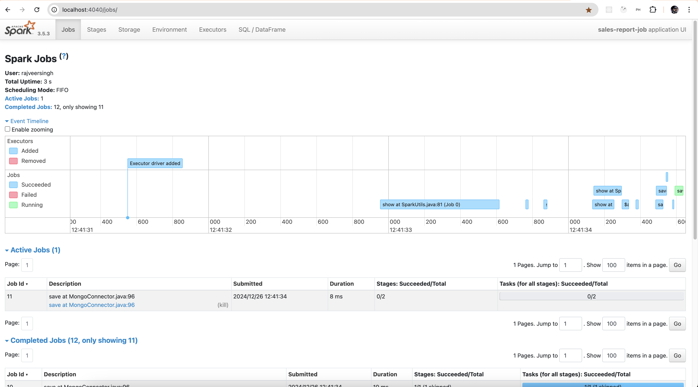

# Daily Sales Report Job
Demo **Spark Batch job** implemented as [Spring Cloud Task](https://spring.io/projects/spring-cloud-task).

## Environment setup
For prerequisites and environment setup instructions refer to [Installation section](../README.md#installation)

### IntelliJ Run Configurations
* Got to main class [**`DailySalesReportJob`**](src/main/java/com/ksoot/spark/sales/DailySalesReportJob.java) and Modify run
  configurations as follows.
* Go to `Modify options`, click on `Add VM options` and set the value as `-Dspring.profiles.active=local` to run in `local` profile.
* Go to `Modify options`, click on `Add VM options` and set the value as `--add-exports java.base/sun.nio.ch=ALL-UNNAMED`  
  to avoid exception `Factory method 'sparkSession' threw exception with message: class org.apache.spark.storage.StorageUtils$ (in unnamed module @0x2049a9c1) cannot access class sun.nio.ch.DirectBuffer (in module java.base) because module java.base does not export sun.nio.ch to unnamed module @0x2049a9c1`.
* Go to `Modify options` and make sure `Add dependencies with "provided" scope to classpath` is checked.
* Run [**`DailySalesReportJob`**](src/main/java/com/ksoot/spark/sales/DailySalesReportJob.java) as Spring boot application. 

## Spark Job implementation
### Spark Configurations
[spring-boot-starter-spark](https://github.com/officiallysingh/spring-boot-starter-spark) is used by adding the following dependency.
```xml
<dependency>
    <groupId>io.github.officiallysingh</groupId>
    <artifactId>spring-boot-starter-spark</artifactId>
    <version>1.1</version>
</dependency>
```
to avail the following features.
- Spark dependencies compatible with Spring boot 3+.
- Customizable `SparkSession` bean auto-configured.
- Spark configurations and auto-completion assistance for Spark configuration properties in `application.yml`
- All possible [Spark configurations](https://spark.apache.org/docs/3.5.3/configuration.html) can be set in `application.yml` as follows.
```yaml
spark:
  driver:
    memory: 2g
    cores: 2
  executor:
    instances: 2
    memory: 2g
    cores: 2
  ui:
    enabled: true
```

### Spark Pipeline
- On application startup it populates sample transaction and master data into respective database collections for last 6 months.
Refer to [DataPopulator](src/main/java/com/ksoot/spark/sales/DataPopulator.java) for details.
- It expects an argument `month` of type `java.time.YearMonth` with default value as current month if not specified and generates sales report for given month.
- Reads sales transaction data from MongoDB database `sales_db`, collection `sales` in Spark `Dataset<Row>`
- Filter this dataset for a given month.
- Then joins it with Product master data fetched from ArangoDB database `products_db`, collection `products` to produce the result dataset.
- The result dataset is then written into MongoDB collection named `sales_report_<input month>`. For example if input month is `2024-11` then output will be written into collection `sales_report_2024_11`.
- For details refer to [SparkPipelineExecutor](src/main/java/com/ksoot/spark/sales/SparkPipelineExecutor.java)
- Following is the Spark pipeline code
```java
public void execute() {
    log.info("Generating Daily sales report for month: {}", this.jobProperties.getMonth());

    Dataset<Row> salesDataset = this.mongoConnector.read("sales");
    SparkUtils.logDataset("Sales Dataset", salesDataset);

    final String statementMonth = this.jobProperties.getMonth().toString();
    // Convert `timestamp` to date and calculate daily sales amount
    Dataset<Row> aggregatedSales =
        salesDataset
            .filter(col("timestamp").startsWith(statementMonth))
            .withColumn("date", col("timestamp").substr(0, 10)) // Extract date part
            .withColumn(
                "sale_amount",
                col("price")
                    .cast(DataTypes.DoubleType)
                    .multiply(col("quantity").cast(DataTypes.IntegerType))) // Calculate sale_amount
            .groupBy("product_id", "date")
            .agg(sum("sale_amount").alias("daily_sale_amount"));

    Dataset<Row> productsDataset = this.arangoConnector.readAll("products");
    SparkUtils.logDataset("Products Dataset", salesDataset);
    productsDataset =
        productsDataset.select(col("_key").as("product_id"), col("name").as("product_name"));

    // Join with the product details dataset
    Dataset<Row> dailySalesReport =
        aggregatedSales
            .join(
                productsDataset,
                aggregatedSales.col("product_id").equalTo(productsDataset.col("product_id")))
            .select(
                productsDataset.col("product_name").as("product"),
                aggregatedSales.col("date"),
                aggregatedSales.col("daily_sale_amount").alias("sale"))
            .orderBy(col("product_name"), col("date"));

    // Show the final result
    SparkUtils.logDataset("Daily Sales report", dailySalesReport);

    final String salesReportCollection = "sales_report_" + statementMonth.replace('-', '_');
    //    this.fileConnector.write(dailySalesReport); // For testing
    this.mongoConnector.write(dailySalesReport, salesReportCollection);
  }
```

### Job Configurations
You can find the default Job configurations in [application.yml](src/main/resources/config/application.yml) as follows.

```yaml
ksoot:
#  Applicable only while running on Windows machine, replace ${HOME} with your directory
  hadoop-dll: ${HOME}/hadoop-3.0.0/bin/hadoop.dll
  job:
    month: ${STATEMENT_MONTH:}
    correlation-id: ${CORRELATION_ID:${spring.application.name}-1}
    persist: ${PERSIST_JOB:false}
    job-stop-topic: ${JOB_STOP_TOPIC:job-stop-requests}
  connector:
    save-mode: Append
    output-mode: Update
    mongo-options:
      url: ${MONGODB_URL:mongodb://localhost:27017}
      database: ${MONGODB_DATABASE:sales_db}
    arango-options:
      endpoints: ${ARANGODB_URL:localhost:8529}
      database: ${ARANGODB_DATABASE:products_db}
      username: ${ARANGODB_USER:root}
      password: ${ARANGODB_PASSWORD:admin}
      ssl-enabled: false
      ssl-cert-value: ""
      cursor-ttl: PT5M # 5 minutes, see the ISO 8601 standard for java.time.Duration String patterns
    file-options:
      format: csv
      header: true
      path: ${SPARK_OUTPUT_PATH:spark-space/output}
      merge: true
    kafka-options:
      bootstrap-servers: ${KAFKA_BOOTSTRAP_SERVERS:localhost:9092}
      fail-on-data-loss: ${KAFKA_FAIL_ON_DATA_LOSS:false}
```

**Description**
* `ksoot.hadoop-dll`:- To run Spark Job on Windows machine, you need to download [winutils](https://github.com/steveloughran/winutils/tree/master/hadoop-3.0.0/bin), extract and set the path in this config.
* `ksoot.job.month`:- The input month for which to generate sales report. The current month is taken as default if not specified. Example `2024-11`.
* `ksoot.job.correlation-id`:- The Job Correlation Id used to track job status or stop a running job from [Stop Job API](../spark-job-service/README.md#stop-spark-job) REST API.
  Its value is set to `spring.cloud.task.external-execution-id`. It is recommended but not required to be unique for each Job execution.
* `ksoot.job.persist`:- If set to `true` the Job status is tracked in Postgres database `spark_job_db`, table `task_execution`.  
  Its value is set to `spring.cloud.task.initialize-enabled`. Default value `false`.
* `ksoot.job.job-stop-topic`:- The kafka topic name where the job listens for requests to Stop the long-running Job. Default value `job-stop-requests`. 
  Expected message content is `correlation-id` of Job execution for which the termination is requested.  
  Multiple Job executions could be running at a time, the running jobs that match the correlation id received in kafka message are terminated.
* `ksoot.job.connector`:- Configurations for various Spark connectors. Refer to [spark-job-commons README.md](../spark-job-commons/README.md#connectors) for details.

> [!IMPORTANT]  
> Configurations in [application.yml](src/main/resources/config/application.yml) are supposed to be production defaults. 
> While running locally, you can override any configuration in [application-local.yml](src/main/resources/config/application-local.yml)

For example to generate sales report for a particular month set `ksoot.job.month` to respective month in [application-local.yml](src/main/resources/config/application-local.yml) as follows.
```yaml
ksoot:
  job:
    month: 2024-11
```

### Error Handling
- In case of any uncaught exceptions, the Job will exit with non-zero exit code.
- Following best practices no need to create any custom exception classes. [JobProblem.java](../spark-job-commons/src/main/java/com/ksoot/spark/common/error/JobProblem.java) can be used to throw exceptions as follows.

```java
try {
    // Some file reading code
} catch (final IOException e) {
  throw JobProblem.of("IOException while listing file by reading from aws").cause(e).build();
}
```
- On job exit and error is logged by [@AfterTask Listener method](../spark-job-commons/src/main/java/com/ksoot/spark/common/SparkExecutionManager.java).
- For scenarios where you don't want the job to exit, Catch and Handle exceptions properly.

### Build
It is required to build the application Uber jar using [`maven-shade-plugin`](https://maven.apache.org/plugins/maven-shade-plugin/), to make it compatible with Spark.
`spring-boot-maven-plugin` should not be used as it packages classes differently in folder `BOOT-INF`. Refer to [pom.xml](pom.xml) for details.
* To build jar, execute following command.
```shell
mvn clean install
```
* To build Docker image, execute following command. Refer to [Dockerfile](Dockerfile) for details.
```shell
docker image build . -t spark-batch-daily-sales-report-job:0.0.1 -f Dockerfile
```

### Spark UI
Access Spark UI at [**`http://localhost:4040`**](http://localhost:4040) to monitor and inspect Spark Batch job execution.



## Spring Cloud Task database
When `ksoot.job.persist` is set to true, Spring cloud task initializes its database schema in Postgres database `spark_jobs_db`.

### Task Executions
If `ksoot.job.persist` is set to `true` then Job status log is tracked as follows in database `spark_jobs_db` table `task_execution`.  
This is a Spring Cloud Task feature, for details refer to [documentation](https://docs.spring.io/spring-cloud-task/reference/features.html)

| task_execution_id | start_time                 | end_time                   | task_name              | exit_code | exit_message | error_message                                                                            | last_updated                  | external_execution_id                | parent_execution_id   |
|-------------------|----------------------------|----------------------------|------------------------|-----------|--------------|------------------------------------------------------------------------------------------|-------------------------------|--------------------------------------|-----------------------|
| 1                 | 2024-12-21 13:15:52.849979 | 2024-12-21 13:17:57.044739 | daily-sales-report-job | 1         | Failed       | com.ksoot.spark.common.util.StreamRetryableException: Exception in spark streaming ..... | 2024-12-21 13:17:57.058191    | d63965ff-2123-4c0e-b965-ff21234c0e9b | NULL                  |
| 2                 | 2024-12-21 13:38:09.022006 | 2024-12-21 13:38:39.857139 | daily-sales-report-job | 1         | Failed       | com.ksoot.spark.common.util.StreamRetryableException: Exception in spark streaming ..... | 2024-12-21 13:38:39.86834     | c1c5ceb1-3574-4ac3-85ce-b13574bac35a | NULL                  |
| 3                 | 2024-12-21 13:38:48.227212 | 2024-12-21 13:38:51.117856 | daily-sales-report-job | 0         | Completed    | NULL                                                                                     | 2024-12-21 13:38:51.54849     | daily-sales-report-job-1             | NULL                  |
| 4                 | 2024-12-21 13:40:22.491883 | 2024-12-21 13:40:25.539387 | daily-sales-report-job | 0         | Completed    | NULL                                                                                     | 2024-12-21 13:40:25.827281    | daily-sales-report-job-2             | NULL                  |
| 5                 | 2024-12-21 13:40:42.24037  | 2024-12-21 13:41:53.290863 | daily-sales-report-job | 0         | Terminated   | NULL                                                                                     | 2024-12-21 13:41:53.789612    | d63965ff-2123-4c0e-b965-ff21234c0e9b | NULL                  |
| 6                 | 2024-12-21 13:45:09.334699 | 2024-12-21 13:45:50.076483 | daily-sales-report-job | 0         | Terminated   | NULL                                                                                     | 2024-12-21 13:46:32.726645    | d63965ff-2123-4c0e-b965-ff21234c0e9b | NULL                  |

## References
- [Apache Spark](https://spark.apache.org/docs/3.5.3)
- [Spark Configurations](https://spark.apache.org/docs/3.5.3/configuration.html)
- [Spring Cloud Task](https://spring.io/projects/spring-cloud-task)
- [Spring boot starter for Spark](https://github.com/officiallysingh/spring-boot-starter-spark).
- [Spark ArangoDB Connector](https://docs.arangodb.com/3.13/develop/integrations/arangodb-datasource-for-apache-spark)
- [Spark MongoDB Connector](https://www.mongodb.com/docs/spark-connector/v10.4)
