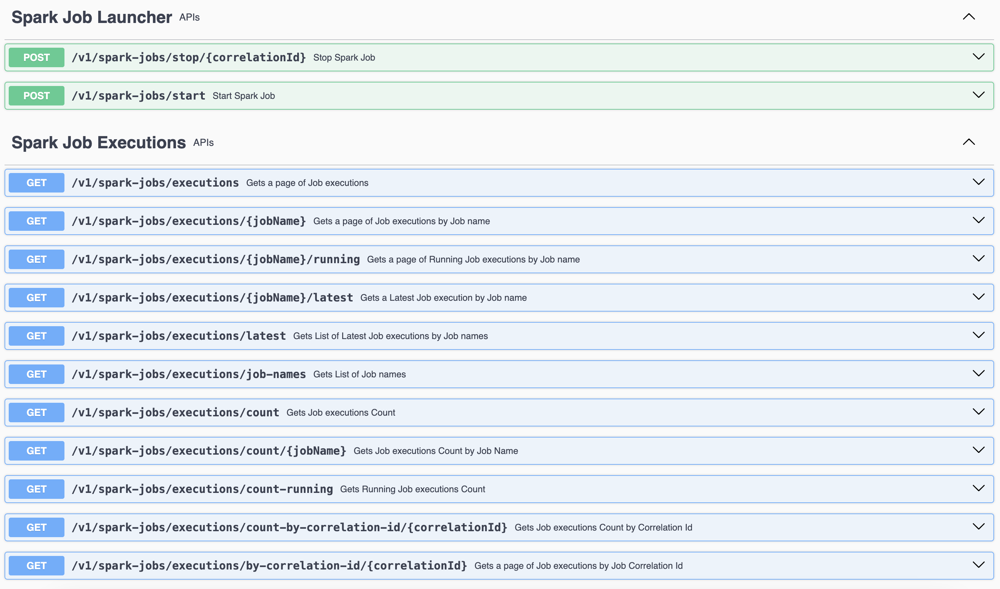

# Spark Job service
Spring boot service to start and stop spark jobs and Track job status, job duration, and error messages if there is any.  
It provides simple REST APIs for that, internally using `spark-submit` to start and kafka messaging to stop jobs respectively.

## Installation
### Prerequisites
- Java 17
- [Scala 2.12.18](https://sdkman.io/install/)
- [Spark 3.5.3](https://archive.apache.org/dist/spark/spark-3.5.3/spark-3.5.3-bin-hadoop3.tgz)
- Docker
- Minikube

Run [**`SparkJobService`**](src/main/java/com/ksoot/spark/SparkJobService.java) as Spring boot application in `local` profile.
> [!IMPORTANT]  
> Make sure environment variable `SPARK_HOME` is set to local spark installation.  
> Make sure environment variable `M2_REPO` is set to local maven repository.

### IntelliJ Run Configurations
* Got to main class [**`SparkJobService`**](src/main/java/com/ksoot/spark/SparkJobService.java) and Modify run
  configurations as follows.
* Go to `Modify options`, click on `Add VM options` and set the value as `-Dspring.profiles.active=local` to run in `local` profile. 
* Go to `Modify options`, click on `Add VM options` and set the value as `-Dspring.profiles.active=minikube` to run in `minikube` profile.
* Open swagger at http://localhost:8090/swagger-ui/index.html?urls.primaryName=Spark+Jobs


## API Reference
You can directly import the [**Postman Collection**](api-spec/Spark%20Job%20Service%20APIs.postman_collection.json)

### Spark Job Launcher APIs

#### Start Spark Job

```http
POST /v1/spark-jobs/start
```

| Request Body    | Type                  | Description                                                                                          | Default                           | Required | 
|:----------------|:----------------------|:-----------------------------------------------------------------------------------------------------|:----------------------------------|:---------|
| `jobName`       | `String`              | Spark Job name, must be present in application.yml spark-submit.jobs                                 | -                                 | Yes      |
| `correlationId` | `String`              | Correlation id for each Job execution. Recommended but not mandatory to be unique for each execution | Random UUID, returned in response | Yes      |
| `sparkConfigs`  | `Map<String, Object>` | Runtime Spark conf properties for this job                                                           | Empty                             | Yes      |

**Supports three types of job launch requests. To support more jobs, Similarly write the corresponding Request class.**
- [DailySalesReportJobLaunchRequest](src/main/java/com/ksoot/spark/dto/DailySalesReportJobLaunchRequest.java)
- [LogsAnalysisJobLaunchRequest](src/main/java/com/ksoot/spark/dto/LogsAnalysisJobLaunchRequest.java)
- [SparkExampleJobLaunchRequest](src/main/java/com/ksoot/spark/dto/SparkExampleJobLaunchRequest.java)

Example curl to start [spark-batch-daily-sales-report-job](../spark-batch-daily-sales-report-job):
```curl
curl -X 'POST' \
  'http://localhost:8090/v1/spark-jobs/start' \
  -H 'accept: */*' \
  -H 'Content-Type: application/json' \
  -d '{
  "jobName": "daily-sales-report-job",
  "correlationId": "71643ba2-1177-4e10-a43b-a21177de1022",
  "sparkConfigs": {
    "spark.executor.instances": 4,
    "spark.driver.cores": 3
  },
  "month": "2024-11"
}'
```

Similary curl to start [spark-stream-logs-analysis-job](../spark-stream-logs-analysis-job):
```curl
curl -X 'POST' \
  'http://localhost:8090/v1/spark-jobs/start' \
  -H 'accept: */*' \
  -H 'Content-Type: application/json' \
  -d '{
  "jobName": "logs-analysis-job"
}'
```

#### Stop Spark Job

```http
POST /v1/spark-jobs/stop/{correlationId}
```

| Parameter       | Type     | Description        | Required |
|:----------------|:---------|:-------------------|:---------|
| `correlationId` | `String` | Job Correlation Id | Yes      |

### Spark Job Executions APIs
**Following APIs are only available if service is running with configuration `spark-launcher.persist-jobs` as `true`.**

#### Get All Job Executions

```http
GET /v1/spark-jobs/executions
```

| Parameter | Type      | Description                                      | Default | Required |
|:----------|:----------|:-------------------------------------------------|:--------|:---------|
| `page`    | `Integer` | Zero-based page index (0..N)                     | 0       | No       |
| `size`    | `Integer` | The size of the page to be returned              | 10      | No       |
| `sort`    | `Sort`    | Sorting criteria in format: property,(asc\|desc) | -       | No       |

#### Get Job Executions By Job Name

```http
GET /v1/spark-jobs/executions/{jobName}
```

| Parameter | Type      | Description                                      | Default | Required |
|:----------|:----------|:-------------------------------------------------|:--------|:---------|
| `jobName` | `String`  | Job name                                         | -       | Yes      |
| `page`    | `Integer` | Zero-based page index (0..N)                     | 0       | No       |
| `size`    | `Integer` | The size of the page to be returned              | 10      | No       |
| `sort`    | `Sort`    | Sorting criteria in format: property,(asc\|desc) | -       | No       |

#### Get Running Job Executions By Job Name

```http
GET /v1/spark-jobs/executions/{jobName}/running
```

| Parameter | Type      | Description                                      | Default | Required |
|:----------|:----------|:-------------------------------------------------|:--------|:---------|
| `jobName` | `String`  | Job name                                         | -       | Yes      |
| `page`    | `Integer` | Zero-based page index (0..N)                     | 0       | No       |
| `size`    | `Integer` | The size of the page to be returned              | 10      | No       |
| `sort`    | `Sort`    | Sorting criteria in format: property,(asc\|desc) | -       | No       |

#### Get Latest Job Execution By Job Name

```http
GET /v1/spark-jobs/executions/{jobName}/latest
```

| Parameter | Type     | Description | Required |
|:----------|:---------|:------------|:---------|
| `jobName` | `String` | Job name    | Yes      |

#### Get Latest Job Executions By Job Names

```http
GET /v1/spark-jobs/executions/latest
```

| Parameter  | Type           | Description | Required |
|:-----------|:---------------|:------------|:---------|
| `jobNames` | `List<String>` | Job Names   | Yes      |

#### Get Job Names

```http
GET /v1/spark-jobs/executions/job-names
```
No parameters required

#### Get Job Executions Count

```http
GET /v1/spark-jobs/executions/count
```
No parameters required

#### Get Job Executions Count By Job Name

```http
GET /v1/spark-jobs/executions/count/{jobName}
```

| Parameter | Type     | Description | Required |
| :-------- |:---------|:------------|:---------|
| `jobName` | `String` | Job name    | Yes      |

#### Get Running Job Executions Count

```http
GET /v1/spark-jobs/executions/count-running
```
No parameters required

#### Get Job Executions Count By Correlation Id

```http
GET /v1/spark-jobs/executions/count-by-correlation-id/{correlationId}
```

| Parameter       | Type     | Description        | Required |
|:----------------|:---------|:-------------------|:---------|
| `correlationId` | `String` | Job Correlation Id | Yes      |

#### Get Job Executions By Correlation Id

```http
GET /v1/spark-jobs/executions/by-correlation-id/{correlationId}
```

| Parameter       | Type      | Description                                      | Default | Required |
|:----------------|:----------|:-------------------------------------------------|:--------|:---------|
| `correlationId` | `String`  | Job Correlation Id                               | -       | Yes      |
| `page`          | `Integer` | Zero-based page index (0..N)                     | 0       | No       |
| `size`          | `Integer` | The size of the page to be returned              | 10      | No       |
| `sort`          | `Sort`    | Sorting criteria in format: property,(asc\|desc) | -       | No       |

### Configurations
#### Spark Configurations
All possible [Spark configurations](https://spark.apache.org/docs/3.5.3/configuration.html) can be set here.  
Remember you have similar Spark configurations in individual Job also. Any configuration set here will override the Job specific configuration.
```yaml
#---------- Spark configurations common to all Jobs -------------------------
spark:
  master: k8s://https://kubernetes.default.svc
  driver:
    memory: 2g
    cores: 2
  executor:
    instances: 2
    memory: 2g
    cores: 2
  default:
    parallelism: 32
#    extraJavaOptions: >
#      -DMONGODB_URL=${MONGODB_URL:mongodb://localhost:27017}
#      -DMONGO_FEATURE_DB=${MONGO_FEATURE_DB:feature-repo}
  kubernetes:
    namespace: spark
    authenticate.driver.serviceAccountName: spark
    driverEnv:
      SPARK_USER: spark
    #Always, Never, and IfNotPresent
#    container.image.pullPolicy: IfNotPresent
  submit.deployMode: cluster
```
#### Job Launcher Configurations
Following are Spark Job Launcher configurations.
```yaml
spark-launcher:
  #  spark-home: ${SPARK_HOME}
  capture-jobs-logs: true
  persist-jobs: true
  env:
    POSTGRES_URL: "jdbc:postgresql://postgres:5432/spark_jobs_db"
    KAFKA_BOOTSTRAP_SERVERS: "kafka:9092"
  jobs:
    daily-sales-report-job:
      main-class-name: com.ksoot.spark.sales.DailySalesReportJob
      jar-file: local:///opt/spark/job-apps/spark-batch-daily-sales-report-job.jar
      env:
        MONGODB_URL: "mongodb://mongo:27017"
        ARANGODB_URL: "arango:8529"
      spark-config:
        spark.kubernetes.container.image: ${DAILY_SALES_REPORT_JOB_IMAGE:spark-batch-daily-sales-report-job:0.0.1}
    logs-analysis-job:
      main-class-name: com.ksoot.spark.loganalysis.LogAnalysisJob
      jar-file: local:///opt/spark/job-apps/spark-stream-logs-analysis-job.jar
      env:
        JDBC_URL: "jdbc:postgresql://postgres:5432"
      spark-config:
        spark.kubernetes.container.image: ${LOGS_ANALYSIS_JOB_IMAGE:spark-stream-logs-analysis-job:0.0.1}
```
**Description**
* `spark-home`: Spark installation directory. Default value is environment variable `SPARK_HOME`.
* `capture-jobs-logs`:- If set to `true` the triggered Job's logs are captures and displayed in this service's logs. Default value `false`. Not recommended in production.
* `persist-jobs`:- If set to `true` the Spring cloud task tracks the Jobs status in configured database. Default value `false`. Recommended in production.
* `env`:- Remember, there are environment variables defined in individual Job's `application.yml` such as `KAFKA_BOOTSTRAP_SERVERS`, `MONGODB_URL` etc.
The values of these environment variables to jobs can be provided from here. It should have environment variables that are common to all jobs.
* `jobs`:- A Map of each Job's configurations you wish to trigger from this service.
Each job must be provided with some basic mandatory configurations and a few optional configurations.
  * `main-class-name`:- Fully qualified Main class name of the Spark Job. Its mandatory, as Spark needs to launch the Job by running its main class.
  * `jar-file`:- Jar file path of the Spark Job. This jar file is used in `spark-submit` command to launch the Job.
  * `env`:- Environment variables specific to this job. It overrides the common environment variables at `spark-launcher.env`.
  * `spark-config`:- Spark configurations specific to this job. It overrides the common Spark configurations at `spark`.
  You can unset any configuration coming from common spark configuration by setting it to `` (blank) here.

> [!IMPORTANT]  
> Job names `daily-sales-report-job` and `logs-analysis-job` given as keys in `spark-launcher.jobs` Map are used in Job start Request.
> Refer to below given curl to start [spark-batch-daily-sales-report-job](../spark-batch-daily-sales-report-job)   
> and Note that `jobName` in Request body must match the key name in `spark-launcher.jobs` Map for this job, `daily-sales-report-job` in this case.
> It is recommended to have job name as `spring.application.name` in Job's `application.yml`.
> Also important to mention that the `sparkConfigs` in Request body will override the configurations in `spark-launcher.jobs.<jobName>.spark-config`, hence takes the highest precedence.
```curl
curl -X 'POST' \
  'http://localhost:8090/v1/spark-jobs/start' \
  -H 'accept: */*' \
  -H 'Content-Type: application/json' \
  -d '{
  "jobName": "daily-sales-report-job",
  "correlationId": "71643ba2-1177-4e10-a43b-a21177de1022",
  "sparkConfigs": {
    "spark.executor.instances": 4,
    "spark.driver.cores": 3
  },
  "month": "2024-11"
}'
```

#### Job Request class
* Each Job has a corresponding Request class to take the Job Start request as each job may have a different set of arguments, though some job arguments are common to all jobs.
* So a base abstract class [JobLaunchRequest.java](src/main/java/com/ksoot/spark/dto/JobLaunchRequest.java) is defined with common arguments.
* For each Job a Request class extending [JobLaunchRequest.java](src/main/java/com/ksoot/spark/dto/JobLaunchRequest.java) should be implemented.
* Refer to [DailySalesReportJobLaunchRequest.java](src/main/java/com/ksoot/spark/dto/DailySalesReportJobLaunchRequest.java) for [spark-batch-daily-sales-report-job](../spark-batch-daily-sales-report-job) and [LogsAnalysisJobLaunchRequest.java](src/main/java/ksoot/spark/dto/LogsAnalysisJobLaunchRequest.java) for [spark-stream-logs-analysis-job](../spark-stream-logs-analysis-job).
* Refer to [Jackson Inheritance](https://www.baeldung.com/jackson-inheritance#2-per-class-annotations) for help in implementing inheritance in request classes.


## Implementation
* At its core it uses [spark-submit](https://spark.apache.org/docs/3.5.4/submitting-applications.html) to launch a Spark Job locally,  
  on minikube or kubernetes in a unified way.
* `spark-submit` command is derived with options coming through configurations in `application.yml` and Job start request Object.  
  Refer to [SparkSubmitCommand Builder](src/main/java/com/ksoot/spark/launcher/SparkSubmitCommand.java) to see how the `spark-submit` command is built.
* [SparkJobLauncher.java](src/main/java/com/ksoot/spark/launcher/SparkJobLauncher.java) is the interface to launch a Spark Job.
  As of now the only implementation is [SparkSubmitJobLauncher.java](src/main/java/com/ksoot/spark/launcher/SparkSubmitJobLauncher.java). However, similar Job Launcher can be implemented for EMR also, placeholder at [SparkEmrJobLauncher.java](src/main/java/com/ksoot/spark/launcher/SparkEmrJobLauncher.java)
* [SparkSubmitJobLauncher.java](src/main/java/com/ksoot/spark/launcher/SparkSubmitJobLauncher.java) launches the Job using `spark-submit` with options derived after merging common Spark configurations, job specific configurations in `application.yml` and Job request object.
  Following is the `spark-submit` command generated for local deployment.
```shell
./bin/spark-submit --verbose --name daily-sales-report-job --class com.ksoot.spark.sales.DailySalesReportJob 
 --conf spark.master=local --conf spark.executor.memory=2g --conf spark.driver.memory=1g --conf spark.driver.cores=3 
--conf spark.executor.cores=1 --conf spark.submit.deployMode=client --conf spark.executor.instances=4 
--conf spark.driver.extraJavaOptions="-Dspring.profiles.active=local -DSTATEMENT_MONTH=2024-11 -DCORRELATION_ID=71643ba2-1177-4e10-a43b-a21177de1022 -DPERSIST_JOB=true" 
 /Users/myusername/.m2/repository/com/ksoot/spark/spark-batch-daily-sales-report-job/0.0.1-SNAPSHOT/spark-batch-daily-sales-report-job-0.0.1-SNAPSHOT.jar
```
This command String is then passed to [spark-job-submit.sh](cmd/spark-job-submit.sh) on mac or linux and [spark-job-submit.bat](cmd/spark-job-submit.bat) on windows to execute the command, as command length could exceed java [Process](https://docs.oracle.com/javase/8/docs/api/java/lang/Process.html) API limit.
* Currently Spark Job can be triggered by REST API. However, it can be enhanced to trigger spark jobs on arrival of Kafka messages, or Scheduler triggers or any other event also.
  You just need to provide the corresponding implementation selected by some runtime strategy and call the intended `SparkJobLauncher` implementation to launch the job, as follows.
```java
this.sparkJobLauncher.startJob(jobLaunchRequest);   
```

### Launching Jobs
Jobs can be launched to run locally or on minikube.

#### Local profile
- Make sure **Postgres** is running at `localhost:5432` with username `postgres` and password `admin`.  
  Create database `spark_jobs_db` and `error_logs_db` if they do not exist.
- Make sure **ArangoDB** running at `localhost:8529` with `root` password as `admin`.
- Make sure **MongoDB** running at `localhost:27017`.
- Make sure **Kafka** running with bootstrap servers `localhost:9092`
- Make sure **Kafka UI** running at `http://localhost:8100`. Create topics `job-stop-requests` and `error-logs` if they do not exist.

> [!IMPORTANT]  
> If any port or credentials are different from above mentioned then override respective configurations in [application-local.yml](src/main/resources/config/application-local.yml).

Either above infrastructure is up and running as local installations in your system, or use **docker compose** using [docker-compose.yml](../docker-compose.yml) to run required infrastructure.
In Terminal go to project root `spring-boot-spark-kubernetes` and execute following command. Make sure Docker is running.
```shell
docker compose up -d
```
* Perform `mvn clean install` to build the jobs and install in local `M2_REPO`. Job jars are picked from local `M2_REPO` while `spark-submit`.
* Run the application in `local` profile and make a call to Job Start API.

#### Minikube profile
* Set minikube core to 4 and memory to 8GB atleast.
* Make sure docker is running and minikube is started.
* Check cluster ip by executing following command.
```shell
kubectl cluster-info
```
The output should look like below.
```shell
Kubernetes control plane is running at https://127.0.0.1:50537
CoreDNS is running at https://127.0.0.1:50537/api/v1/namespaces/kube-system/services/kube-dns:dns/proxy

To further debug and diagnose cluster problems, use 'kubectl cluster-info dump'.
```
* Set above port number `50537` in configuration `spark.master` value k8s://https://127.0.0.1:50537
* Whenever minikube is restarted this port number changes, so make sure to get the new port and change in `spark.master` configuration.
* In Terminal go to project root project `spring-boot-spark-kubernetes` and execute following command.
```shell
kubectl apply -f infra-k8s-deployment.yml
```
* Set default namespace to `ksoot` in minikube. You can always rollback it to default namespace.
```shell
kubectl config set-context --current --namespace=ksoot
```
* Check if all infra pods are running.
```shell
kubectl get pods
```
Output should look like below.
```shell
NAME                         READY   STATUS    RESTARTS   AGE
arango-65d6fff6c5-4bjwq      1/1     Running   0          6m16s
kafka-74c8d9579f-jmcr5       1/1     Running   0          6m16s
kafka-ui-797446869-9d8zw     1/1     Running   0          6m16s
mongo-6785c5cf8b-mtbk7       1/1     Running   0          6m16s
postgres-685b766f66-7dnsl    1/1     Running   0          6m16s
zookeeper-6fc87d48df-2t5pf   1/1     Running   0          6m16s
```
* Execute following command to build base spark image.
```shell
docker image build . -t ksoot/spark:3.5.3 -f Dockerfile
```
* In Terminal go to project `spring-boot-spark-kubernetes/spark-batch-daily-sales-report-job` and execute following command to build docker image for `daily-sales-report-job`.
```shell
docker image build . -t spark-batch-daily-sales-report-job:0.0.1 -f Dockerfile
```
* In Terminal go to project `spring-boot-spark-kubernetes/spark-stream-logs-analysis-job` and execute following command to build docker image for `logs-analysis-job`.
```shell
docker image build . -t spark-stream-logs-analysis-job:0.0.1 -f Dockerfile
```
* Load Job images in minikube.
```shell
docker image build . -t spark-batch-daily-sales-report-job:0.0.1 -f Dockerfile
docker image build . -t spark-stream-logs-analysis-job:0.0.1 -f Dockerfile
```
* To Launch the Jobs on minikube in `cluster` deploy mode, run the application in `minikube` profile and make a call to Job Start API.
  API response should look like below.
```text
Spark Job: 'daily-sales-report-job' submit request accepted for asynchronous execution. Correlation Id: 71643ba2-1177-4e10-a43b-a21177de1022. For real status of Job look into application logs or Driver POD logs if deploying on Kubernetes
```
* If `spark-submit` command is successful, you can see the Spark Driver and executor pods running in minikube.
```shell
kubectl get pods
```
Output should look like below.
```shell
NAME                                             READY   STATUS    RESTARTS   AGE
daily-sales-report-job-2e9c6f93ef784c17-driver   1/1     Running   0          11s
daily-sales-report-job-9ac2e493ef78625a-exec-1   1/1     Running   0          6s
daily-sales-report-job-9ac2e493ef78625a-exec-2   1/1     Running   0          6s
```
* Once Job is complete executor pods are terminated automatically.
  But driver pod remains in completed state, it does not consume any resources.
```shell
NAME                                             READY   STATUS      RESTARTS   AGE
daily-sales-report-job-2e9c6f93ef784c17-driver   0/1     Completed   0          2m56s
```
* If Job fails executor pods are still terminated, but driver pod remains in error state. For debugging you can see pod logs.
* Eventually you may want to cleanup by deleting the pods or `minikube delete`.

## References
- [Spark Submit](https://spark.apache.org/docs/3.5.4/submitting-applications.html)
- [Running Spark on Kubernetes](https://spark.apache.org/docs/3.5.4/running-on-kubernetes.html)
