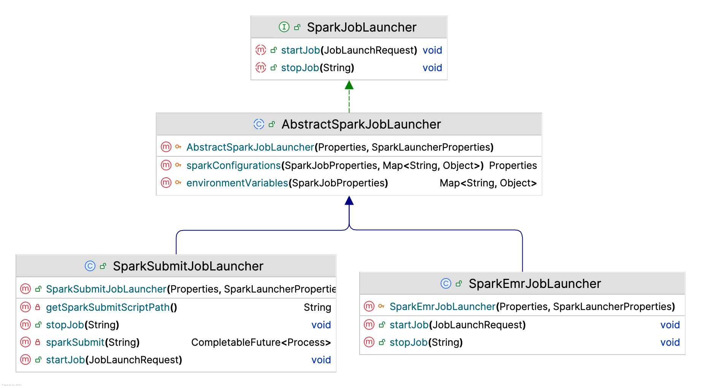
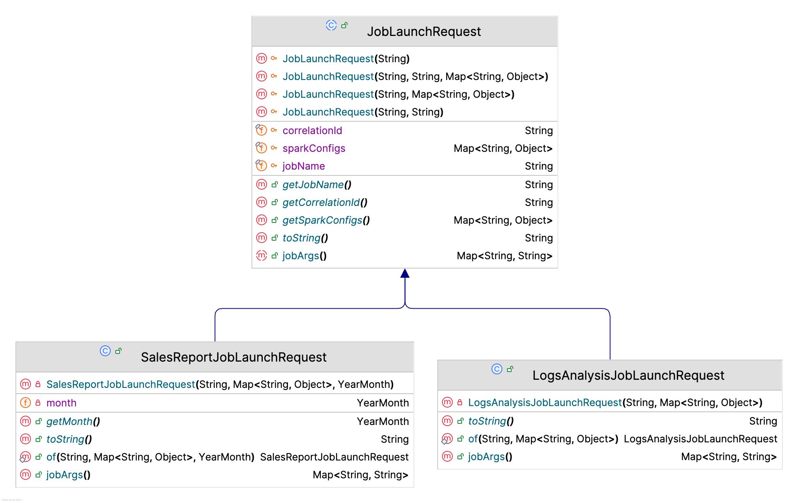

# Spark Job service
Spring boot service providing Simple REST APIs to Start, Stop Spark Jobs and Track job status, job duration, error details etc.  

## Installation

### Environment setup
For prerequisites and environment setup, refer to [Installation Instructions](../README.md#installation)

## Configurations
### Spark Configurations
All possible [Spark configurations](https://spark.apache.org/docs/3.5.3/configuration.html) can be set in [application.yml](src/main/resources/config/application.yml) as follows. Remember, there are Spark configurations in individual Jobs such as [daily-sales-report-job's application.yml](../spark-batch-daily-sales-report-job/src/main/resources/config/application.yml) and [logs-analysis-job's application.yml](../spark-stream-logs-analysis-job/src/main/resources/config/application.yml) also.  
Any configuration set here takes higher precedence hence override all Job's default Spark configurations as given in respective Job's `application.yml`. So, set only those configuration overrides here, which are common to all Jobs. Individual Job configurations can be overridden in `spark-launcher.jobs` configuration as highlighted in next section.
```yaml
#---------- Spark configurations common to all Jobs -------------------------
spark:
  master: k8s://https://kubernetes.default.svc
#  master: local[*]
  driver:
    memory: 2g
    cores: 2
  executor:
    instances: 2
    memory: 2g
    cores: 2
  default:
    parallelism: 32
#    extraJavaOptions: >
#      -DMONGODB_URL=${MONGODB_URL:mongodb://localhost:27017}
#      -DMONGO_FEATURE_DB=${MONGO_FEATURE_DB:feature-repo}
  kubernetes:
    namespace: spark
    authenticate.driver.serviceAccountName: spark
    driverEnv:
      SPARK_USER: spark
    #Always, Never, and IfNotPresent
#    container.image.pullPolicy: IfNotPresent
  submit.deployMode: cluster
```

### Job Launcher Configurations
Following are Spark Job Launcher configurations.
```yaml
spark-launcher:
  #  spark-home: ${SPARK_HOME}
  capture-jobs-logs: true
  persist-jobs: true
  env:
    POSTGRES_URL: "jdbc:postgresql://postgres:5432/spark_jobs_db"
    KAFKA_BOOTSTRAP_SERVERS: "kafka:9092"
  jobs:
    daily-sales-report-job:
      main-class-name: com.ksoot.spark.sales.DailySalesReportJob
      jar-file: local:///opt/spark/job-apps/spark-batch-daily-sales-report-job.jar
      env:
        MONGODB_URL: "mongodb://mongo:27017"
        ARANGODB_URL: "arango:8529"
      spark-config:
        spark.kubernetes.container.image: ${DAILY_SALES_REPORT_JOB_IMAGE:spark-batch-daily-sales-report-job:0.0.1}
    logs-analysis-job:
      main-class-name: com.ksoot.spark.loganalysis.LogAnalysisJob
      jar-file: local:///opt/spark/job-apps/spark-stream-logs-analysis-job.jar
      env:
        JDBC_URL: "jdbc:postgresql://postgres:5432"
      spark-config:
        spark.kubernetes.container.image: ${LOGS_ANALYSIS_JOB_IMAGE:spark-stream-logs-analysis-job:0.0.1}
```
**Description**
* `spark-home`: Spark installation directory. Default value is environment variable `SPARK_HOME`.
* `capture-jobs-logs`:- If set to `true` the triggered Job's logs are captured and displayed in this service's logs. Default value `false`. Enable for local dev/testing only, Not recommended in production.
* `persist-jobs`:- If set to `true` the Spring cloud task tracks the Jobs status in configured Postgres database, `spark_jobs_db`. Default value `false`. Recommended in production.
* `env`:- Remember, there are environment variables defined in individual Job's `application.yml` such as `KAFKA_BOOTSTRAP_SERVERS`, `MONGODB_URL` etc.
The values of these environment variables for jobs can be provided from here. This configuration property should have environment variables overrides that are common to all jobs.
* `jobs`:- A Map of each Job's configurations you wish to trigger from this service.
Each job must be provided with some basic mandatory configurations and a few optional configurations.
  * `main-class-name`:- Fully qualified Main class name of the Spark Job. Its mandatory, as Spark needs it to launch the Job by running its main class.
  * `jar-file`:- Jar file path of the Spark Job. Its also mandatory, as this jar file is used in `spark-submit` command to launch the Job.
  * `env`:- Optional environment variables specific to this job. It has higher precedence hence overrides the common environment variables at `spark-launcher.env`. Effective environment variables passed to `spark-submit` command are a merge of common environment variables and job-specific environment variables.
  * `spark-config`:- Optional spark configurations specific to this job. It has higher precedence hence overrides the common Spark configurations in this `application.yml`. Effective Spark configurations passed to `spark-submit` command are a merge of common spark configurations and job-specific spark configurations.
  You can also unset any configuration coming from common spark configuration by setting it to `` (blank) here.

> [!IMPORTANT]  
> Job names `daily-sales-report-job` and `logs-analysis-job` given as keys in `spark-launcher.jobs` Map, are used in Job start Request.  
> Refer to below given curl to start [daily-sales-report-job](../spark-batch-daily-sales-report-job) and Note that `jobName` in Request body must match the key name in `spark-launcher.jobs` Map, `daily-sales-report-job` in this case.  
> It is recommended to have job name as `spring.application.name` in respective Job's `application.yml`.  
> Another thing to note about job name is that the Driver and Executor pods created for this job in Kubernetes will have this job name as prefix.
```curl
curl -X 'POST' \
  'http://localhost:8090/v1/spark-jobs/start' \
  -H 'accept: */*' \
  -H 'Content-Type: application/json' \
  -d '{
  "jobName": "daily-sales-report-job",
  "correlationId": "71643ba2-1177-4e10-a43b-a21177de1022",
  "sparkConfigs": {
    "spark.executor.instances": 4,
    "spark.driver.cores": 3
  },
  "month": "2024-11"
}'
```

## Launcher Implementation
* At its core it uses [spark-submit](https://spark.apache.org/docs/3.5.4/submitting-applications.html) to launch a Spark Job locally, on minikube or kubernetes in a unified way.
* `spark-submit` command is derived with options coming through configurations in `application.yml`, `deployment.yml` (in case of Minikube/Kubernetes) and Job start request Object.
  Refer to [SparkSubmitCommand Builder](src/main/java/com/ksoot/spark/launcher/SparkSubmitCommand.java) to see how the `spark-submit` command is built.
* [SparkJobLauncher.java](src/main/java/com/ksoot/spark/launcher/SparkJobLauncher.java) is the interface to launch a Spark Job.
  As of now the only implementation is [SparkSubmitJobLauncher.java](src/main/java/com/ksoot/spark/launcher/SparkSubmitJobLauncher.java). However, similar Job Launcher can be implemented for EMR also, placeholder at [SparkEmrJobLauncher.java](src/main/java/com/ksoot/spark/launcher/SparkEmrJobLauncher.java)
* [SparkSubmitJobLauncher.java](src/main/java/com/ksoot/spark/launcher/SparkSubmitJobLauncher.java) launches the Job using `spark-submit`. Following is the `spark-submit` example command to launch `daily-sales-report-job` for local deployment.
```shell
./bin/spark-submit --verbose --name daily-sales-report-job --class com.ksoot.spark.sales.DailySalesReportJob 
--conf spark.master=local --conf spark.executor.memory=2g --conf spark.driver.memory=1g --conf spark.driver.cores=3 
--conf spark.executor.cores=1 --conf spark.submit.deployMode=client --conf spark.executor.instances=4 
--conf spark.driver.extraJavaOptions="-Dspring.profiles.active=local -DSTATEMENT_MONTH=2024-11 -DCORRELATION_ID=71643ba2-1177-4e10-a43b-a21177de1022 -DPERSIST_JOB=true" 
 /Users/myusername/.m2/repository/com/ksoot/spark/spark-batch-daily-sales-report-job/0.0.1-SNAPSHOT/spark-batch-daily-sales-report-job-0.0.1-SNAPSHOT.jar
```
* This command String is then passed to [spark-job-submit.sh](cmd/spark-job-submit.sh) on mac or linux and [spark-job-submit.bat](cmd/spark-job-submit.bat) on windows to execute the command, as command length could exceed java [Process](https://docs.oracle.com/javase/8/docs/api/java/lang/Process.html) API limit.
* Currently Spark Job can be triggered using REST API only. However, implementation can be done to trigger spark jobs on arrival of Kafka messages, or Scheduler triggers or any other event also.
  You just need to provide the corresponding implementation selected by some runtime strategy and call the intended `SparkJobLauncher` implementation to launch the job, as follows.
```java
this.sparkJobLauncher.startJob(jobLaunchRequest);   
```


#### Job Request class
* Each Job has a corresponding Request class to take the Job Start request parameters, as each job may have a different set of arguments.
* Though some job arguments are common to all jobs, So a base abstract class [JobLaunchRequest.java](src/main/java/com/ksoot/spark/dto/JobLaunchRequest.java) is defined with common arguments i.e. `jobName`, `correlationId` and `sparkConfigs`.
* For each Job, a Request class extending [JobLaunchRequest.java](src/main/java/com/ksoot/spark/dto/JobLaunchRequest.java) should be implemented. Refer to Request class [DailySalesReportJobLaunchRequest.java](src/main/java/com/ksoot/spark/dto/DailySalesReportJobLaunchRequest.java) for [daily-sales-report-job](../spark-batch-daily-sales-report-job) and [LogsAnalysisJobLaunchRequest.java](src/main/java/ksoot/spark/dto/LogsAnalysisJobLaunchRequest.java) for [logs-analysis-job](../spark-stream-logs-analysis-job).
* Provide a Map of arguments specific to this Job in `jobArgs` method implementation. [SparkSubmitJobLauncher.java](src/main/java/com/ksoot/spark/launcher/SparkSubmitJobLauncher.java) will use these arguments to pass in `spark-submit` command. 
For example, [DailySalesReportJobLaunchRequest.java](src/main/java/com/ksoot/spark/dto/DailySalesReportJobLaunchRequest.java) provides Statement month argument to `daily-sales-report-job` Job, which expects the month argument with name `STATEMENT_MONTH`, as you can see in [daily-sales-report-job application.yml](src/main/resources/config/application.yml) property `ksoot.job.month`.
```java
  @Override
  public Map<String, String> jobArgs() {
    // Alternatively can use argument name as `ksoot.job.month` also.
    return Map.of("STATEMENT_MONTH", month.toString());
  }
```
* Refer to [Jackson Inheritance](https://www.baeldung.com/jackson-inheritance#2-per-class-annotations) to understand implementing inheritance in request classes.
> [!IMPORTANT]  
> Also important to mention that the `sparkConfigs` in Request body enjoys the **highest precedence** hence overrides the configurations in `spark-job-service`'s `application.yml` and `deployment.yml`, as explained in [Configurations precedence order]()



### Running locally
Run [**`SparkJobService`**](src/main/java/com/ksoot/spark/SparkJobService.java) locally in either [`local`](#local-profile) or [`minikube`](#minikube-profile) profile. Once application is up and running.
* Import the [**Postman Collection**](api-spec/Spark%20Job%20Service%20APIs.postman_collection.json) and make API calls to start, stop or track jobs.
* Alternatively, you can open Swagger at http://localhost:8090/swagger-ui/index.html?urls.primaryName=Spark+Jobs and make API calls.


#### Local profile
* For environment setup to run in `local` profile, refer to [Installation preferably using docker compose section](../README.md#docker-compose).
* Set active profile as `local`. In IntelliJ, Go to `Modify options`, click on `Add VM options` and set `-Dspring.profiles.active=local`.
* Run [**`SparkJobService`**](src/main/java/com/ksoot/spark/SparkJobService.java) as Spring boot application.
> [!IMPORTANT]  
> Jobs can only be Launched in `client deploy mode` in `local` profile.
> For each Job execution a new JVM is spun up, but `spark.executor.instances` configuration is not honored and multiple JVMs are not spun up.


#### Minikube profile
* For environment setup to run in `minikube` profile, refer to [Installation using minikube section](../README.md#minikube).
* Set active profile as `minikube`. In IntelliJ, Go to `Modify options`, click on `Add VM options` and set `-Dspring.profiles.active=minikube`.
* Get Minikube master port number by running the following command.
```shell
kubectl cluster-info
```
The output should look like below.
```shell
Kubernetes control plane is running at https://127.0.0.1:50537
CoreDNS is running at https://127.0.0.1:50537/api/v1/namespaces/kube-system/services/kube-dns:dns/proxy

To further debug and diagnose cluster problems, use 'kubectl cluster-info dump'.
```
* Set above port number `50537` in configuration `spark.master` value `k8s://https://127.0.0.1:50537` in [application-minikube.yml](src/main/resources/config/application-minikube.yml)  
Whenever minikube is restarted this port number changes, so make sure to get the new port and change in `spark.master` configuration.
* In Terminal go to project `spring-boot-spark-kubernetes` and execute the following command to build base spark image.
```shell
docker image build . -t ksoot/spark:3.5.3 -f Dockerfile
```
* In Terminal go to project `spring-boot-spark-kubernetes/spark-batch-daily-sales-report-job` and execute following command to build docker image for `daily-sales-report-job`.
```shell
docker image build . -t spark-batch-daily-sales-report-job:0.0.1 -f Dockerfile
```
* In Terminal go to project `spring-boot-spark-kubernetes/spark-stream-logs-analysis-job` and execute following command to build docker image for `logs-analysis-job`.
```shell
docker image build . -t spark-stream-logs-analysis-job:0.0.1 -f Dockerfile
```
* Load Job images in minikube.
```shell
minikube image load spark-batch-daily-sales-report-job:0.0.1
minikube image load spark-stream-logs-analysis-job:0.0.1
```
* Run [**`SparkJobService`**](src/main/java/com/ksoot/spark/SparkJobService.java) as Spring boot application.
* Make a call to Job Start API. API response should look like below.
```text
Spark Job: 'daily-sales-report-job' submit request accepted for asynchronous execution. Correlation Id: 71643ba2-1177-4e10-a43b-a21177de1022. For real status of Job look into application logs or Driver POD logs if deploying on Kubernetes
```
* If `spark-submit` command is successful, then you can see the Spark Driver and Executor pods running in minikube.
```shell
kubectl get pods
```
Output should look like below.
```shell
NAME                                             READY   STATUS    RESTARTS   AGE
daily-sales-report-job-2e9c6f93ef784c17-driver   1/1     Running   0          11s
daily-sales-report-job-9ac2e493ef78625a-exec-1   1/1     Running   0          6s
daily-sales-report-job-9ac2e493ef78625a-exec-2   1/1     Running   0          6s
```
* Once the Job is complete, executor pods are terminated automatically. But driver pod remains in completed state, it does not consume any resources.
```shell
NAME                                             READY   STATUS      RESTARTS   AGE
daily-sales-report-job-2e9c6f93ef784c17-driver   0/1     Completed   0          2m56s
```
* If the Job fails, Executor pods are still terminated, but driver pod remains in `Error` state. For debugging, you can see pod logs.
* Eventually you may want to clean up by deleting the pods or `minikube delete`.
> [!IMPORTANT]  
> `spark-job-service` still runs on local, but Spark Jobs are launched on minikube using corresponding Job's Docker images.

### Running on Minikube
* Make sure environment setup is already done and default namespace is set to `ksoot`, refer to [Installation using minikube section](../README.md#minikube).
* In Terminal go to project `spring-boot-spark-kubernetes/spark-job-service` and execute following command to build docker image for `spark-job-service`.
```shell
docker image build . -t spark-job-service:0.0.1 -f Dockerfile
```
* Load Job `spark-job-service` image in minikube.
```shell
minikube image load spark-job-service:0.0.1
```
* Execute following command to deploy `spark-job-service` on minikube.
```shell
kubectl apply -f deployment.yml
```
* Verify that `spark-job-service` pod is running
```shell
kubectl get pods
```
Output should look like below.
```shell
NAME                                READY   STATUS              RESTARTS   AGE
spark-job-service-f545bd7d8-s4sn5   1/1     Running             0          9s
```
* Port forward  `spark-job-service` server port in a separate terminal, to access it from local.
```shell
kubectl port-forward spark-job-service-f545bd7d8-s4sn5 8090:8090
```
Output should look like below.
```shell
Forwarding from 127.0.0.1:8090 -> 8090
Forwarding from [::1]:8090 -> 8090
```
* Access Swagger at http://localhost:8090/swagger-ui/index.html?urls.primaryName=Spark+Jobs and make API calls to start and stop or explore jobs.
> [!IMPORTANT]  
> All applications run in `default` profile on minikube.

## API Reference

### Spark Job Launcher APIs

#### Start Spark Job

```http
POST /v1/spark-jobs/start
```

| Request Body    | Type                  | Description                                                                                          | Default                           | Required | 
|:----------------|:----------------------|:-----------------------------------------------------------------------------------------------------|:----------------------------------|:---------|
| `jobName`       | `String`              | Spark Job name, must be present in application.yml spark-submit.jobs                                 | -                                 | Yes      |
| `correlationId` | `String`              | Correlation id for each Job execution. Recommended but not mandatory to be unique for each execution | Random UUID, returned in response | Yes      |
| `sparkConfigs`  | `Map<String, Object>` | Runtime Spark conf properties for this job                                                           | Empty                             | Yes      |

**Supports three types of job launch requests. To support more jobs, Similarly write the corresponding Request class.**
- [DailySalesReportJobLaunchRequest](src/main/java/com/ksoot/spark/dto/DailySalesReportJobLaunchRequest.java)
- [LogsAnalysisJobLaunchRequest](src/main/java/com/ksoot/spark/dto/LogsAnalysisJobLaunchRequest.java)
- [SparkExampleJobLaunchRequest](src/main/java/com/ksoot/spark/dto/SparkExampleJobLaunchRequest.java) Just to test the example jar included in Spark distribution.

Example curl to start [spark-batch-daily-sales-report-job](../spark-batch-daily-sales-report-job):
```curl
curl -X 'POST' \
  'http://localhost:8090/v1/spark-jobs/start' \
  -H 'accept: */*' \
  -H 'Content-Type: application/json' \
  -d '{
  "jobName": "daily-sales-report-job",
  "correlationId": "71643ba2-1177-4e10-a43b-a21177de1022",
  "sparkConfigs": {
    "spark.executor.instances": 4,
    "spark.driver.cores": 3
  },
  "month": "2024-11"
}'
```

Similarly, curl to start [spark-stream-logs-analysis-job](../spark-stream-logs-analysis-job):
```curl
curl -X 'POST' \
  'http://localhost:8090/v1/spark-jobs/start' \
  -H 'accept: */*' \
  -H 'Content-Type: application/json' \
  -d '{
  "jobName": "logs-analysis-job"
}'
```

#### Stop Spark Job

```http
POST /v1/spark-jobs/stop/{correlationId}
```

| Parameter       | Type     | Description        | Required |
|:----------------|:---------|:-------------------|:---------|
| `correlationId` | `String` | Job Correlation Id | Yes      |

### Spark Job Executions APIs
**Following APIs are only available if service is running with configuration `spark-launcher.persist-jobs` as `true`.**

#### Get All Job Executions

```http
GET /v1/spark-jobs/executions
```

| Parameter | Type      | Description                                      | Default | Required |
|:----------|:----------|:-------------------------------------------------|:--------|:---------|
| `page`    | `Integer` | Zero-based page index (0..N)                     | 0       | No       |
| `size`    | `Integer` | The size of the page to be returned              | 10      | No       |
| `sort`    | `Sort`    | Sorting criteria in format: property,(asc\|desc) | -       | No       |

#### Get Job Executions By Job Name

```http
GET /v1/spark-jobs/executions/{jobName}
```

| Parameter | Type      | Description                                      | Default | Required |
|:----------|:----------|:-------------------------------------------------|:--------|:---------|
| `jobName` | `String`  | Job name                                         | -       | Yes      |
| `page`    | `Integer` | Zero-based page index (0..N)                     | 0       | No       |
| `size`    | `Integer` | The size of the page to be returned              | 10      | No       |
| `sort`    | `Sort`    | Sorting criteria in format: property,(asc\|desc) | -       | No       |

#### Get Running Job Executions By Job Name

```http
GET /v1/spark-jobs/executions/{jobName}/running
```

| Parameter | Type      | Description                                      | Default | Required |
|:----------|:----------|:-------------------------------------------------|:--------|:---------|
| `jobName` | `String`  | Job name                                         | -       | Yes      |
| `page`    | `Integer` | Zero-based page index (0..N)                     | 0       | No       |
| `size`    | `Integer` | The size of the page to be returned              | 10      | No       |
| `sort`    | `Sort`    | Sorting criteria in format: property,(asc\|desc) | -       | No       |

#### Get Latest Job Execution By Job Name

```http
GET /v1/spark-jobs/executions/{jobName}/latest
```

| Parameter | Type     | Description | Required |
|:----------|:---------|:------------|:---------|
| `jobName` | `String` | Job name    | Yes      |

#### Get Latest Job Executions By Job Names

```http
GET /v1/spark-jobs/executions/latest
```

| Parameter  | Type           | Description | Required |
|:-----------|:---------------|:------------|:---------|
| `jobNames` | `List<String>` | Job Names   | Yes      |

#### Get Job Names

```http
GET /v1/spark-jobs/executions/job-names
```
No parameters required

#### Get Job Executions Count

```http
GET /v1/spark-jobs/executions/count
```
No parameters required

#### Get Job Executions Count By Job Name

```http
GET /v1/spark-jobs/executions/count/{jobName}
```

| Parameter | Type     | Description | Required |
| :-------- |:---------|:------------|:---------|
| `jobName` | `String` | Job name    | Yes      |

#### Get Running Job Executions Count

```http
GET /v1/spark-jobs/executions/count-running
```
No parameters required

#### Get Job Executions Count By Correlation Id

```http
GET /v1/spark-jobs/executions/count-by-correlation-id/{correlationId}
```

| Parameter       | Type     | Description        | Required |
|:----------------|:---------|:-------------------|:---------|
| `correlationId` | `String` | Job Correlation Id | Yes      |

#### Get Job Executions By Correlation Id

```http
GET /v1/spark-jobs/executions/by-correlation-id/{correlationId}
```

| Parameter       | Type      | Description                                      | Default | Required |
|:----------------|:----------|:-------------------------------------------------|:--------|:---------|
| `correlationId` | `String`  | Job Correlation Id                               | -       | Yes      |
| `page`          | `Integer` | Zero-based page index (0..N)                     | 0       | No       |
| `size`          | `Integer` | The size of the page to be returned              | 10      | No       |
| `sort`          | `Sort`    | Sorting criteria in format: property,(asc\|desc) | -       | No       |

## References
- [Apache Spark](https://spark.apache.org/docs/3.5.3)
- [Spark Submit](https://spark.apache.org/docs/3.5.4/submitting-applications.html)
- [Running Spark on Kubernetes](https://spark.apache.org/docs/3.5.4/running-on-kubernetes.html)
- [Spark UI](https://spark.apache.org/docs/3.5.3/web-ui.html)
- [Spark Configurations](https://spark.apache.org/docs/3.5.3/configuration.html)
- [Exception handling in Spring boot Web applications](https://github.com/officiallysingh/spring-boot-problem-handler).
