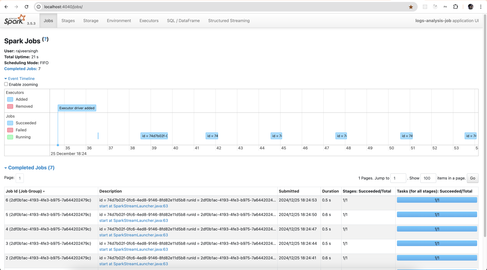

# Log Analysis Job
Demo **Spark Streaming job** implemented as [Spring Cloud Task](https://spring.io/projects/spring-cloud-task).

## Environment setup
For prerequisites and environment setup, refer to [Installation Instructions](../README.md#installation)

### IntelliJ Run Configurations
* Got to main class [**`LogAnalysisJob`**](src/main/java/com/ksoot/spark/loganalysis/LogAnalysisJob.java) and Modify run
  configurations as follows.
* Go to `Modify options`, click on `Add VM options` and set `-Dspring.profiles.active=local` to run in `local` profile.
* Go to `Modify options`, click on `Add VM options` and add option `--add-exports java.base/sun.nio.ch=ALL-UNNAMED`  
  to avoid exception `Factory method 'sparkSession' threw exception with message: class org.apache.spark.storage.StorageUtils$ (in unnamed module @0x2049a9c1) cannot access class sun.nio.ch.DirectBuffer (in module java.base) because module java.base does not export sun.nio.ch to unnamed module @0x2049a9c1`.
* Go to `Modify options` and make sure `Add dependencies with "provided" scope to classpath` is checked.
* Run [**`LogAnalysisJob`**](src/main/java/com/ksoot/spark/loganalysis/LogAnalysisJob.java) as Spring boot application.

## Spark Job implementation
### Spark Configurations
[spring-boot-starter-spark](https://github.com/officiallysingh/spring-boot-starter-spark) is used by adding the following dependency.
```xml
<dependency>
    <groupId>io.github.officiallysingh</groupId>
    <artifactId>spring-boot-starter-spark</artifactId>
    <version>1.1</version>
</dependency>
```
to avail the following features.
- Spark dependencies compatible with Spring boot 3+.
- Customizable `SparkSession` bean auto-configured.
- Enables auto-completion assistance for Spark configuration properties in `application.yml`
- All possible [Spark configurations](https://spark.apache.org/docs/3.5.3/configuration.html) can be set in `application.yml` as follows. 
```yaml
spark:
  ui:
    enabled: true
  streaming:
    stopGracefullyOnShutdown: true
  sql:
    streaming:
      checkpointLocation: ${CHECKPOINT_LOCATION:spark-space/checkpoints}
      forceDeleteTempCheckpointLocation: true
    adaptive:
      enabled: true
  checkpoint:
    compress: true
```

### Spark Pipeline
- Randomly generated error logs are written to kafka topic `error-logs` every 3 seconds to generate data artificially for Spark stream to run. For details refer to [LogsGenerator](src/main/java/com/ksoot/spark/loganalysis/LogsGenerator.java).
- Spark streaming pipeline connects to kafka topic `error-logs` and read the text log messages as stream in `Dataset<Row>`.
- Then it filters the data with log level `ERROR`.
- Then it writes the output to Postgres database `error_logs_db` table `error_logs` as continuous stream.
- Application starts and awaits on Spark `DataStreamWriter` in a `Retryable` wrapper to make it fault-tolerant.
- For details refer to [SparkPipelineExecutor](src/main/java/com/ksoot/spark/loganalysis/SparkPipelineExecutor.java)
- Following is the Spark pipeline code
```java
public void execute() {
  Dataset<Row> kafkaLogs =
          this.kafkaConnector.readStream(this.connectorProperties.getKafkaOptions().getTopic());
  // Deserialize Kafka messages as text
  Dataset<Row> logLines = kafkaLogs.selectExpr("CAST(value AS STRING) as log_line");
  // Just for testing
  //    this.writeToConsole(errorLogs);

  Dataset<Row> errorLogs =
          logLines
                  .filter(col("log_line").rlike(LOG_REGEX))
                  .select(
                          regexp_extract(col("log_line"), LOG_REGEX, 1).alias("datetime"),
                          regexp_extract(col("log_line"), LOG_REGEX, 3).alias("application"),
                          regexp_extract(col("log_line"), LOG_REGEX, 4).alias("error_message"));

  DataStreamWriter<Row> logsStreamWriter =
          this.jdbcConnector.writeStream(errorLogs, ERROR_LOGS_TABLE);
  // Start the stream in separate thread
  this.sparkStreamLauncher.startStream(logsStreamWriter);
}
```

> [!IMPORTANT]  
> In case of recoverable errors always wrap exception in `StreamRetryableException` and throw it,  
> so that Job does not exit, but keep on retrying to connect to recover from transient errors such as kafka connectivity issues.
> But in some error situations you may want the job to fail, don't catch such exceptions.


### Configurations
You can find the default Job configurations in [application.yml](src/main/resources/config/application.yml) as follows.

```yaml
ksoot:
  #  Applicable only while running on Windows machine, replace ${HOME} with your directory
  hadoop-dll: ${HOME}/hadoop-3.0.0/bin/hadoop.dll
  job:
    correlation-id: ${CORRELATION_ID:${spring.application.name}-1}
    persist: ${PERSIST_JOB:false}
    job-stop-topic: ${JOB_STOP_TOPIC:job-stop-requests}
  connector:
    save-mode: Append
    output-mode: Update
    jdbc-options:
      url: ${JDBC_URL:jdbc:postgresql://localhost:5432}
      database: ${JDBC_DB:error_logs_db}
      username: ${JDBC_USER:postgres}
      password: ${JDBC_PASSWORD:admin}
      batchsize: ${JDBC_BATCH_SIZE:1000}
      isolation-level: ${JDBC_ISOLATION_LEVEL:READ_UNCOMMITTED}
    file-options:
      format: csv
      header: true
      path: ${SPARK_OUTPUT_PATH:spark-space/output}
      merge: true
    kafka-options:
      bootstrap-servers: ${KAFKA_BOOTSTRAP_SERVERS:localhost:9092}
      topic: ${KAFKA_ERROR_LOGS_TOPIC:error-logs}
      fail-on-data-loss: ${KAFKA_FAIL_ON_DATA_LOSS:false}
```

**Description**
* `ksoot.hadoop-dll`:- To run Spark Job on Windows machine, you need to download [winutils](https://github.com/steveloughran/winutils/tree/master/hadoop-3.0.0/bin), extract and set the path in this config.
* `ksoot.job.correlation-id`:- The Job Correlation Id used to track job status or stop a running job from [Job Stop API](../spark-job-service/README.md#stop-spark-job) REST API.
  Its value is set to `spring.cloud.task.external-execution-id`. It is recommended but not required to be unique for each Job execution.
* `ksoot.job.persist`:- If set to `true` the Job status is tracked in Postgres database `spark_job_db`, table `task_execution`.  
  Its value is set to `spring.cloud.task.initialize-enabled`. Default value `false`.
* `ksoot.job.job-stop-topic`:- The kafka topic name where the job listens for requests to Stop the long-running Job. Default value `job-stop-requests`.
  Expected message content is `correlation-id` of Job execution for which the termination is requested.  
  Multiple Job executions could be running at a time, the running jobs that match the correlation id received in kafka message are terminated.
* `ksoot.job.connector`:- Configurations for various Spark connectors. Refer to [Connectors configurations](../spark-job-commons/README.md#connectors) for details.

> [!IMPORTANT]  
> Configurations in [application.yml](src/main/resources/config/application.yml) are supposed to be production defaults.
> While running locally, you can override any configuration in [application-local.yml](src/main/resources/config/application-local.yml)

For example to fail the job on data loss set `ksoot.connector.kafka-options.fail-on-data-loss` to `true` as follows.
```yaml
ksoot:
  connector:
    save-mode: Append
    output-mode: Update
    file-options:
      format: parquet
    kafka-options:
      fail-on-data-loss: true
```

### Error Handling
- In case of any uncaught exceptions, the Job will exit with non-zero exit code.
- Following best practices no need to create any custom exception classes. [JobProblem.java](../spark-job-commons/src/main/java/com/ksoot/spark/common/error/JobProblem.java) can be used to throw exceptions as follows.

```java
try {
    // Some file reading code
} catch (final IOException e) {
  throw JobProblem.of("IOException while listing file by reading from aws").cause(e).build();
}
```
- On job exit and error is logged by [@AfterTask Listener method](../spark-job-commons/src/main/java/com/ksoot/spark/common/SparkExecutionManager.java).
- For scenarios where you don't want the job to exit, Catch and Handle exceptions properly.

### Build
It is required to build the application Uber jar using [`maven-shade-plugin`](https://maven.apache.org/plugins/maven-shade-plugin/), to make it compatible with Spark.
`spring-boot-maven-plugin` should not be used as it packages classes differently in folder `BOOT-INF`. Refer to [pom.xml](pom.xml) for details.
* To build jar, execute following command.
```shell
mvn clean install
```
* To build Docker image, execute following command. Refer to project [Dockerfile](Dockerfile) and [Base Dockerfile](../Dockerfile) for details.
```shell
docker image build . -t spark-stream-logs-analysis-job:0.0.1 -f Dockerfile
```

## Deploy on minikube
The job jar can be manually deployed on Minikube using a mounted volume as follows. The `jar` size is too large to `spark-submit` without mounting volume.
* For environment setup, refer to [Installation using minikube section](../README.md#minikube).
* Create a folder `kubevol/spark-apps` in your local `HOME` directory.
* Copy Job Jar [`spark-stream-logs-analysis-job-0.0.1-SNAPSHOT.jar`](target/spark-stream-logs-analysis-job-0.0.1-SNAPSHOT.jar) in this folder.
* Mount this folder in minikube. Execute following command in a separate terminal and keep it running.
```shell
echo $HOME
minikube mount $HOME/kubevol/spark-apps:/tmp/spark-apps
```
Output should look like below.
```shell
📁  Mounting host path /Users/rajveersingh/kubevol/spark-apps into VM as /tmp/spark-apps ...
    ▪ Mount type:   9p
    ▪ User ID:      docker
    ▪ Group ID:     docker
    ▪ Version:      9p2000.L
    ▪ Message Size: 262144
    ▪ Options:      map[]
    ▪ Bind Address: 127.0.0.1:51527
🚀  Userspace file server: ufs starting
✅  Successfully mounted /Users/rajveersingh/kubevol/spark-apps to /tmp/spark-apps
```
Confirm if you can see your jar in mounted volume.
```shell
minikube ssh
ls -ld /tmp/spark-apps
ls /tmp/spark-apps
```
* Get Minikube master port number by running the following command.
```shell
kubectl cluster-info
```
The output should look like below.
```shell
Kubernetes control plane is running at https://127.0.0.1:50537
CoreDNS is running at https://127.0.0.1:50537/api/v1/namespaces/kube-system/services/kube-dns:dns/proxy

To further debug and diagnose cluster problems, use 'kubectl cluster-info dump'.
```
* Set above port number `50537` in configuration `--master` value `k8s://https://127.0.0.1:50537` following `spark-submit` command.
> [!IMPORTANT]
> Whenever minikube is restarted this port number changes, so make sure to get the new port and change in `spark.master` configuration again.
* Load `officiallysingh/spark:3.5.3` image into minikube as follows.
```shell
minikube image load officiallysingh/spark:3.5.3
```
* Go to `SPARK_HOME` in terminal.
```shell
cd $SPARK_HOME
```
* Launch Job using `spark-submit` as follows.
```shell
./bin/spark-submit \
    --master k8s://https://127.0.0.1:50537 \
    --deploy-mode cluster \
    --name logs-analysis-job \
    --class com.ksoot.spark.loganalysis.LogAnalysisJob \
    --conf spark.kubernetes.container.image=officiallysingh/spark:3.5.3 \
    --conf spark.kubernetes.namespace=ksoot \
    --conf spark.kubernetes.authenticate.driver.serviceAccountName=spark \
    --conf spark.kubernetes.driverEnv.SPARK_USER=spark \
    --conf spark.executor.instances=2 \
    --conf spark.driver.extraJavaOptions="-DPOSTGRES_URL=jdbc:postgresql://postgres:5432/spark_jobs_db -DKAFKA_BOOTSTRAP_SERVERS=kafka:9092  -DJDBC_URL=jdbc:postgresql://postgres:5432" \
    --conf spark.kubernetes.file.upload.path=/tmp/spark-apps \
    --conf spark.kubernetes.driver.volumes.hostPath.spark-host-mount.mount.path=/tmp/spark-apps \
    --conf spark.kubernetes.driver.volumes.hostPath.spark-host-mount.options.path=/tmp/spark-apps \
    --conf spark.kubernetes.executor.volumes.hostPath.spark-host-mount.mount.path=/tmp/spark-apps \
    --conf spark.kubernetes.executor.volumes.hostPath.spark-host-mount.options.path=/tmp/spark-apps \
    local:///tmp/spark-apps/spark-stream-logs-analysis-job-0.0.1-SNAPSHOT.jar
```

### Spark UI
Access Spark UI at [**`http://localhost:4040`**](http://localhost:4040) to monitor and inspect Spark Streaming job execution.



## Spring Cloud Task database
When `ksoot.job.persist` is set to true, Spring cloud task initializes its database schema in Postgres database `spark_jobs_db`.

### Task Executions
If `ksoot.job.persist` is set to `true` then Job status log is tracked as follows in database `spark_jobs_db` table `task_execution`.  
This is a Spring Cloud Task feature, for details refer to [documentation](https://docs.spring.io/spring-cloud-task/reference/features.html)

| task_execution_id | start_time                 | end_time                   | task_name         | exit_code | exit_message | error_message                                                                            | last_updated                  | external_execution_id                | parent_execution_id   |
|-------------------|----------------------------|----------------------------|-------------------|-----------|--------------|------------------------------------------------------------------------------------------|-------------------------------|--------------------------------------|-----------------------|
| 1                 | 2024-12-21 13:15:52.849979 | 2024-12-21 13:17:57.044739 | logs-analysis-job | 1         | Failed       | com.ksoot.spark.common.util.StreamRetryableException: Exception in spark streaming ..... | 2024-12-21 13:17:57.058191    | 6056ece7-b9b2-4dfc-96ec-e7b9b21dfc7b | NULL                  |
| 2                 | 2024-12-21 13:38:09.022006 | 2024-12-21 13:38:39.857139 | logs-analysis-job | 1         | Failed       | com.ksoot.spark.common.util.StreamRetryableException: Exception in spark streaming ..... | 2024-12-21 13:38:39.86834     | 6056ece7-b9b2-4dfc-96ec-e7b9b21dfc7b | NULL                  |
| 3                 | 2024-12-21 13:38:48.227212 | 2024-12-21 13:38:51.117856 | logs-analysis-job | 0         | Completed    | NULL                                                                                     | 2024-12-21 13:38:51.54849     | daily-sales-report-job-1             | NULL                  |
| 4                 | 2024-12-21 13:40:22.491883 | 2024-12-21 13:40:25.539387 | logs-analysis-job | 0         | Completed    | NULL                                                                                     | 2024-12-21 13:40:25.827281    | daily-sales-report-job-2             | NULL                  |
| 5                 | 2024-12-21 13:40:42.24037  | 2024-12-21 13:41:53.290863 | logs-analysis-job | 0         | Terminated   | NULL                                                                                     | 2024-12-21 13:41:53.789612    | db68fc3a-61ec-4b92-a8fc-3a61ec8b9256 | NULL                  |
| 6                 | 2024-12-21 13:45:09.334699 | 2024-12-21 13:45:50.076483 | logs-analysis-job | 0         | Terminated   | NULL                                                                                     | 2024-12-21 13:46:32.726645    | 2ef21e4b-d31b-45f2-b21e-4bd31b75f2f9 | NULL                  |

## Licence
Open source [**The MIT License**](http://www.opensource.org/licenses/mit-license.php)

## Authors and acknowledgment
[**Rajveer Singh**](https://www.linkedin.com/in/rajveer-singh-589b3950/), In case you find any issues or need any support, please email me at raj14.1984@gmail.com.
Give it a :star: on [Github](https://github.com/officiallysingh/spring-boot-spark-kubernetes) and a :clap: on [**medium.com**](https://officiallysingh.medium.com/spark-spring-boot-starter-e206def765b9) if you find it helpful.

## References
- [Apache Spark](https://spark.apache.org/docs/3.5.3)
- [Spark Configurations](https://spark.apache.org/docs/3.5.3/configuration.html)
- [Spark Streaming](https://spark.apache.org/docs/3.5.3/streaming-programming-guide.html)
- [Spark Kafka Connector](https://spark.apache.org/docs/3.5.1/structured-streaming-kafka-integration.html)
- [Spark UI](https://spark.apache.org/docs/3.5.3/web-ui.html)
- [Spring Cloud Task](https://spring.io/projects/spring-cloud-task)
- [Spring boot starter for Spark](https://github.com/officiallysingh/spring-boot-starter-spark).